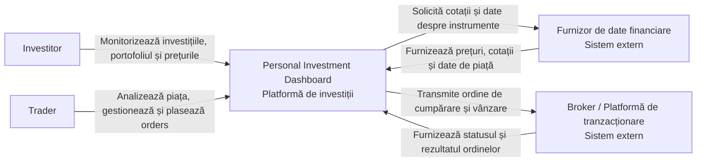

# Laboratorul 1: Definește produsul inițial (Personal Investment Dashboard)

## 1. Cercetarea produsului

| Produs       | Utilizatorul probabil și obiectivul său                                                                            | Model reutilizabil                                                                                                                                                                               |
| ------------ | ------------------------------------------------------------------------------------------------------------------ | ------------------------------------------------------------------------------------------------------------------------------------------------------------------------------------------------ |
| Apple Stocks | **Utilizator:** investitor sau persoană interesată de piețele financiare. **Obiectiv:** informare și monitorizare. | Utilizatorul dorește să urmărească prețurile și evoluția instrumentelor financiare, să consulte date de piață, grafice și știri financiare pentru a fi informat cu privire la investițiile sale. |
| TradingView  | **Utilizator:** trader sau investitor activ. **Obiectiv:** analiză și executarea/gestionarea tranzacțiilor.        | Utilizatorul dorește să analizeze piețele folosind grafice și indicatori tehnici, să identifice oportunități și să execute sau să gestioneze tranzacții.                                         |

## 2. Părți interesate și actori

| **Parte interesată**                                  | **Motivație** | **Influență** | **Motiv**                                                                                                                    |
| ----------------------------------------------------- | ------------- | ------------- | ---------------------------------------------------------------------------------------------------------------------------- |
| **Investitor individual**                             | Ridicată      | Ridicată      | Folosește Dashboard-ul pentru monitorizarea și analiza propriilor investiții și poate influența direct cerințele produsului. |
| **Trader activ**                                      | Ridicată      | Ridicată      | Are nevoie de date și instrumente de analiză în timp real și poate influența funcționalitățile de tranzacționare.            |
| **Administratorul Dashboard-ului**                    | Ridicată      | Ridicată      | Gestionează sistemul, utilizatorii și configurările și poate modifica direct funcționarea produsului.                        |
| **Furnizori de date financiare**                      | Scăzută       | Ridicată      | Furnizează datele de piață de care depinde Dashboard-ul, influențând disponibilitatea și calitatea acestora.                 |
| **Broker / platformă de tranzacționare**              | Scăzută       | Ridicată      | Poate furniza servicii de tranzacționare și integrarea necesară pentru plasarea ordinelor.                                   |
| **Autorități de reglementare**                        | Scăzută       | Ridicată      | Pot impune cerințe privind utilizarea și prelucrarea datelor financiare și activitățile de investiții.                       |
| **Dezvoltatorul produsului**                          | Ridicată      | Ridicată      | Proiectează și implementează funcționalitățile Dashboard-ului și poate modifica produsul.                                    |
| **Familia / persoanele apropiate ale investitorului** | Scăzută       | Scăzută       | Pot fi afectate indirect de deciziile financiare ale utilizatorului, dar nu interacționează direct cu Dashboard-ul.          |

| **Motivație** | **Influență scăzută**        | **Influență ridicată**                                                                         |
| ------------- | ---------------------------- | ---------------------------------------------------------------------------------------------- |
| **Ridicată**  | —                            | Investitor individual; Trader activ; Administratorul Dashboard-ului; Dezvoltatorul produsului  |
| **Scăzută**   | Familia / persoane apropiate | Furnizori de date financiare; Broker / platformă de tranzacționare; Autorități de reglementare |

| **Parte interesată**                     | **Clasificare**       | **Apare în System Context View?** |
| ---------------------------------------- | --------------------- | --------------------------------- |
| **Investitor individual**                | Actor uman direct     | **Da**                            |
| **Trader activ**                         | Actor uman direct     | **Da**                            |
| **Administratorul Dashboard-ului**       | Actor uman direct     | **Da**                            |
| **Dezvoltatorul produsului**             | Altă parte interesată | Nu                                |
| **Furnizor de date financiare**          | Sistem extern         | **Da**                            |
| **Broker / platformă de tranzacționare** | Sistem extern         | **Da**                            |
| **Autorități de reglementare**           | Altă parte interesată | Nu                                |
| **Familie / persoane apropiate**         | Altă parte interesată | Nu                                |

## 3. Promisiunea și domeniul de aplicare ale produsului

### **Promisiunea produsului**

**Personal Investment Dashboard ajută investitorii individuali să își monitorizeze și să își analizeze investițiile, astfel încât să înțeleagă mai clar evoluția portofoliului și să ia decizii informate.**

### **Obiective incluse în prima versiune**

1. **Monitorizarea investițiilor** — utilizatorul poate vedea evoluția instrumentelor financiare pe care le urmărește.
2. **Gestionarea portofoliului** — utilizatorul poate vedea investițiile deținute și valoarea lor totală.
3. **Analiza performanței** — utilizatorul poate vedea cum au evoluat investițiile pe perioade diferite.
4. **Compararea instrumentelor financiare** — utilizatorul poate compara evoluția mai multor instrumente.
5. **Gestionarea tranzacțiilor** — utilizatorul poate transmite ordine de cumpărare sau vânzare și poate vedea rezultatul acestora.

### **Obiective excluse din prima versiune**

1. **Automatizarea deciziilor de investiții** — produsul nu va cumpăra sau vinde automat instrumente financiare în numele utilizatorului.
2. **Tranzacționarea tuturor tipurilor de active** — prima versiune nu va acoperi instrumente financiare care nu sunt disponibile prin sursele integrate.
3. **Gestionarea fiscală a investițiilor** — produsul nu va calcula și nu va gestiona obligațiile fiscale ale utilizatorului.

## 4. Cerințe funcționale

### **DASH-1 — Monitorizarea instrumentelor financiare**

**Obiectivul actorului:** Investitorul dorește să urmărească evoluția instrumentelor financiare relevante pentru el.

**Povestea de Utilizator:**  
**Ca investitor, vreau să urmăresc prețul și evoluția instrumentelor financiare, astfel încât să fiu informat despre situația investițiilor mele.**

**Definițiile de Făcut:**

- Prețul și variația instrumentului selectat sunt afișate cu datele disponibile.
- Dacă datele sunt **învechite sau indisponibile**, utilizatorul este informat că informația nu este actualizată.
- Utilizatorul poate urmări doar instrumentele pentru care există date disponibile.

---

### **DASH-2 — Vizualizarea portofoliului**

**Obiectivul actorului:** Investitorul dorește să cunoască structura și evoluția propriului portofoliu.

**Povestea de Utilizator:**  
**Ca investitor, vreau să îmi urmăresc portofoliul și performanța investițiilor, astfel încât să înțeleg cum evoluează capitalul meu.**

**Definițiile de Făcut:**

- Sunt prezentate investițiile deținute și valoarea lor curentă.
- Este calculată evoluția valorii portofoliului pe perioada selectată.
- Dacă o investiție nu are date actualizate, aceasta este marcată ca **neactualizată**, fără a fi prezentată ca informație curentă.

---

### **DASH-3 — Analizarea oportunităților de investiții**

**Obiectivul actorului:** Investitorul dorește să compare instrumente financiare pe baza informațiilor disponibile.

**Povestea de Utilizator:**  
**Ca investitor, vreau să compar instrumente financiare, astfel încât să pot evalua diferențele dintre investițiile urmărite.**

**Definițiile de Făcut:**

- Utilizatorul poate compara evoluția mai multor instrumente disponibile.
- Sunt prezentate aceleași tipuri de informații pentru instrumentele comparate.
- Instrumentele fără date suficiente sau **neacceptate pentru comparație** sunt excluse și utilizatorul este informat despre acest lucru.

---

### **DASH-4 — Analiza performanței**

**Obiectivul actorului:** Investitorul dorește să afle cum au evoluat investițiile sale într-o anumită perioadă.

**Povestea de Utilizator:**  
**Ca investitor, vreau să analizez performanța investițiilor pe diferite perioade, astfel încât să înțeleg evoluția acestora în timp.**

**Definițiile de Făcut:**

- Utilizatorul poate analiza evoluția pentru perioade diferite.
- Sunt evidențiate modificările valorii investiției în perioada aleasă.
- Dacă perioada selectată nu are suficiente date, sistemul informează utilizatorul că analiza nu poate fi realizată complet.

---

### **DASH-5 — Executarea unei tranzacții**

**Obiectivul actorului:** Traderul dorește să transmită un ordin pentru cumpărarea sau vânzarea unui instrument financiar.

**Povestea de Utilizator:**  
**Ca trader, vreau să plasez un ordin de cumpărare sau vânzare, astfel încât să pot efectua o tranzacție asupra unui instrument financiar.**

**Definițiile de Făcut:**

- Un ordin valid este acceptat și utilizatorul primește confirmarea tranzacției.
- Un ordin cu informații lipsă, valori invalide sau instrument **neacceptat** este respins și utilizatorul este informat despre motiv.
- Tranzacția poate fi inițiată numai de un utilizator **autorizat** să efectueze operațiuni de tranzacționare.

## 5. C4 System Context

## Listă de verificare

- [x] Am cercetat cel puțin două produse existente.

- [x] Am citat dovezi pentru fiecare model de produs selectat.

- [x] Cercetarea mea a modificat sau a confirmat cel puțin o decizie despre domeniul de aplicare.

- [x] Am cartografiat motivația și influența părților interesate.

- [x] Am separat părțile interesate, actorii umani direcți și sistemele externe.

- [x] Promisiunea produsului meu este o propoziție clară.

- [x] Obiectivele și obiectivele mele excluse sunt compatibile cu promisiunea produsului.

- [x] Am scris cel puțin cinci povești de Utilizator.

- [x] Fiecare poveste are între două și patru definiții de Făcut.

- [x] Cel puțin două povești includ un rezultat alternativ important.

- [x] Dependențele mele externe includ un rezultat lipsă, învechit sau neacceptat, care este vizibil pentru Utilizator.

- [x] Am creat un C4 System Context view pentru Dashboard.
