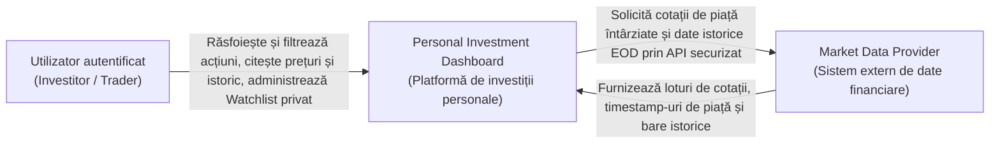
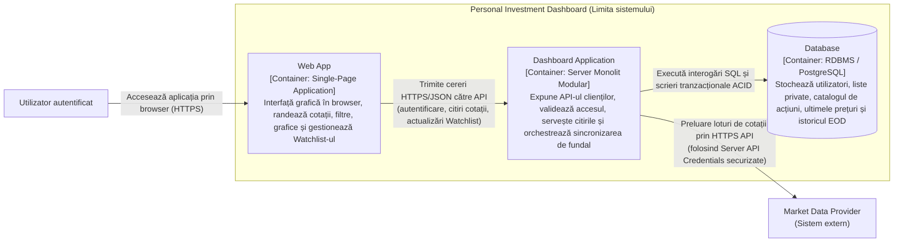
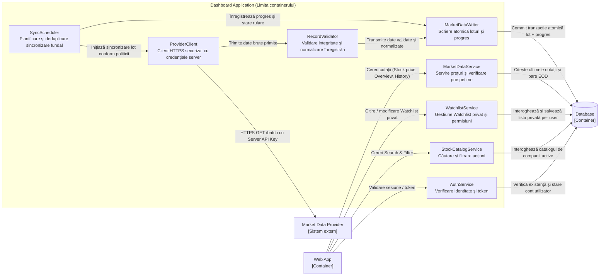
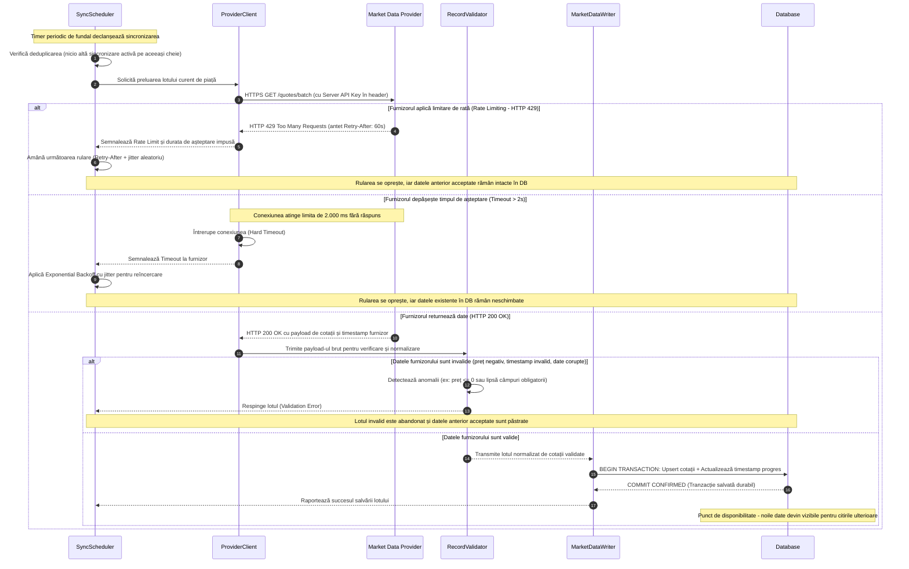
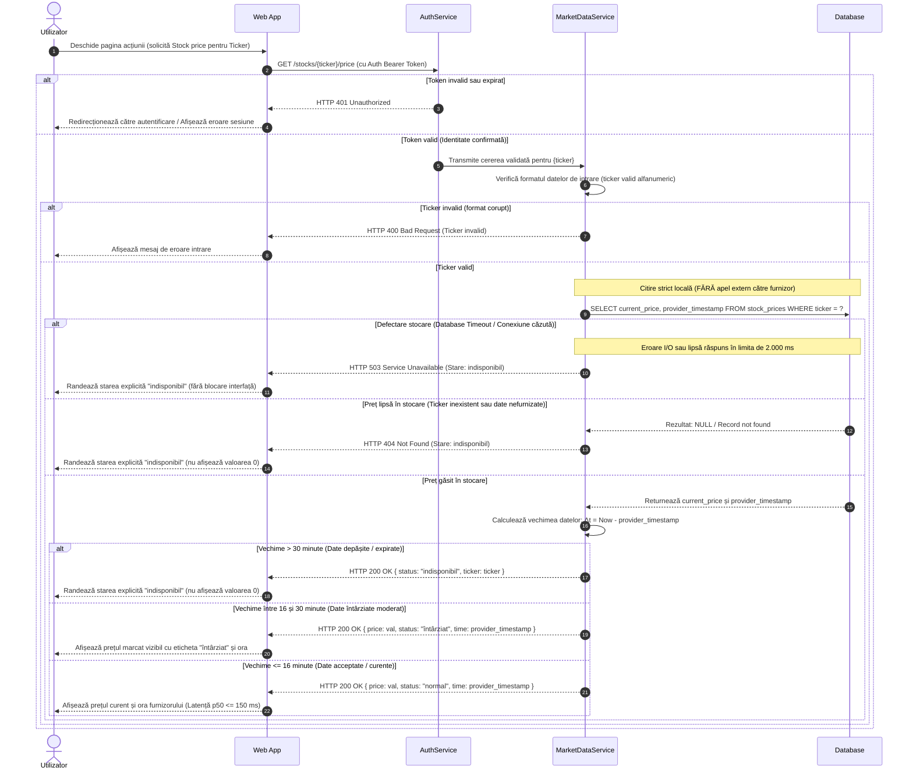
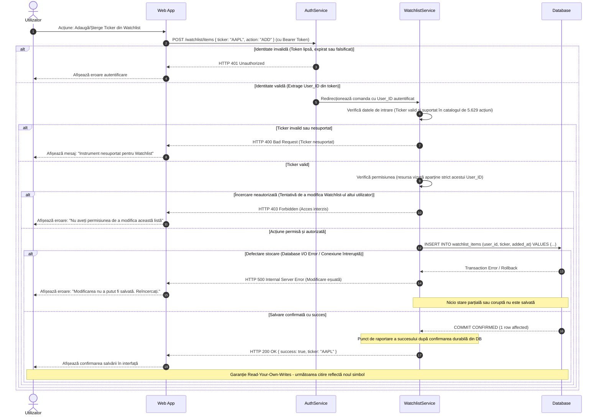

# Laboratorul 3: Desenează limita Dashboard-ului (Baseline Architecture)

## 1. Diagrama System Context (Nivelul 1 C4)

### Definirea limitei sistemului, a actorilor și a dependențelor externe

În conformitate cu modelul de arhitectură C4 (Nivelul 1 – System Context), tratăm **Personal Investment Dashboard (PID)** ca pe o „cutie neagră” (*black box*), ascunzând complet orice detaliu intern de implementare, procese de execuție sau stocări de date.

Scopul acestei diagrame este de a arăta:
1. **Actorul uman:** **Utilizatorul autentificat** (care acoperă atât *Investitorul individual*, cât și *Traderul activ* definiți în Laboratorul 1), cel care interacționează direct cu aplicația pentru a consulta cotații, istoricul graficelor, a efectua căutări/filtrări și a gestiona propriul Watchlist privat.
2. **Sistemul extern:** **Market Data Provider**, un serviciu terț independent de la care sistemul preia cotațiile de piață și barele zilnice istorice (EOD). Sistemul extern operează în mod autonom, are propriile constrângeri de rată (*rate limits*), latențe și disponibilitate.
3. **Limita sistemului (System Boundary):** Delimitează strict ceea ce este sub controlul nostru direct (*Personal Investment Dashboard*) de actorii și serviciile terțe din afara responsabilității directe.

### Diagrama Mermaid System Context

### Justificarea relațiilor

* **Utilizator autentificat $\rightarrow$ PID:** Relația reprezintă fluxul de interacțiune al utilizatorului autentificat, care accesează funcționalitățile definite în Lab 1 și cuantificate în Lab 2 (`Overview`, `Filter`, `Stock price`, `History`, `Watchlist`, `Search`). Utilizatorul consumă date și trimite comenzi de actualizare a listei proprii.
* **PID $\rightarrow$ Market Data Provider:** Relația reprezintă dependența externă de date financiare. Dashboard-ul inițiază preluarea cotațiilor pentru cele 5.629 de acțiuni SUA acceptate.
* **Market Data Provider $\rightarrow$ PID:** Furnizorul livrează date de piață supuse unei întârzieri nominale (15 minute), însoțite de timestamp-ul furnizorului (*provider timestamp*). Răspunsurile pot fi limitate (*HTTP 429*) sau pot eșua, aspecte gestionate la nivelurile inferioare ale arhitecturii.

---

## 2. Diagrama Container (Nivelul 2 C4)

### Alegerea celui mai mic set de containere (*Smallest Viable Set*)

Conform cerinței din laborator de a alege **cel mai mic set de părți de execuție și stocări de date** care poate îndeplini cerințele, adoptăm principiul arhitectural **Monolith First** (recomandat de Martin Fowler și analizat în Lecția 4):

1. **Evitarea microserviciilor premature:** În Laboratorul 2 s-a demonstrat că întreaga stare activă a celor 5.629 de acțiuni ocupă doar **0.54 MiB** în memorie, iar volumul total de stocare pe 5 ani este de **~513.17 MiB** ($< 0.5\text{ GiB}$). La un debit maxim de **10.296 RPS** la deschiderea pieței (cu marja de 10% inclusă), fragmentarea sistemului în microservicii multiple ar adăuga overhead inutil de rețea, serializare, complexitate de orchestrare și multiple puncte de defectare în cascadă (*failure domains*).
2. **Separarea clară Frontend / Backend / Stocare:**
   * **Web App (Single-Page Application):** Rulează în browserul clientului; oferă interfața grafică UI, execută randarea graficelor și menține sesiunea interfeței utilizatorului.
   * **Dashboard Application (Backend Server):** Un proces server unitar (monolit modular) care servește API-ul clienților, gestionează autentificarea/autorizarea, citește datele pentru utilizatori și rulează în fundal sincronizarea cu furnizorul extern.
   * **Database (Relational Data Store):** O bază de date relațională unică (ex. PostgreSQL) care garantează tranzacționalitate ACID, persistență durabilă și suportă garanția *Read-Your-Own-Writes* pentru Watchlist-ul privat.

### Tabelul responsabilităților containerelor

| Container | Tip | Tehnologie ilustrativă | Responsabilitate unică |
| :--- | :--- | :--- | :--- |
| **Web App** | Client Application (SPA) | TypeScript / React | Randează interfața utilizatorului în browser, preia acțiunile utilizatorului, trimite cereri HTTP/JSON și afișează stările explicite (`întârziat`, `indisponibil`). |
| **Dashboard Application** | Server Application | Go / Node.js / Java | Expune endpoint-urile REST API, validează identitatea și permisiunile, servește datele de piață din stocare și rulează sarcina de fundal pentru sincronizarea periodică cu furnizorul extern. |
| **Database** | Data Store | PostgreSQL | Asigură persistența durabilă pentru utilizatori, watchlist-urile private (300.000 rânduri), metadata celor 5.629 de acțiuni și istoricul pe 5 ani (7.092.540 înregistrări EOD). Garantează tranzacții atomice pentru loturile de piață. |

### Diagrama Mermaid Container

### Justificarea arhitecturii containerelor

1. **Decuplarea totală a citirilor utilizatorului de apelurile externe:** `Web App` comunică exclusiv cu `Dashboard Application`. Nicio cerere a utilizatorului nu ajunge direct la `Market Data Provider`. Credențialele API ale furnizorului rămân strict securizate pe server în `Dashboard Application`, protejate împotriva expunerii în browserul clientului.
2. **Dimensionarea stocării conform calculelor din Lab 2:** Datele de referință (1.07 MiB), cotațiile curente (0.54 MiB) și listele private (14.31 MiB) reprezintă un volum extrem de compact, permițând ca un singur cluster de bază de date să gestioneze ușor interogările, menținând în același timp integritatea referențială și izolarea strictă între utilizatori.

---

## 3. Diagrama Component (Nivelul 3 C4)

### Descompunerea containerului Dashboard Application

În conformitate cu Nivelul 3 C4, deschidem **exclusiv containerul `Dashboard Application`**. Toate containerele adiacente (`Web App`, `Database`) și sistemele externe (`Market Data Provider`) rămân în afara limitei aplicației și comunică direct doar cu componentele responsabile.

În interiorul `Dashboard Application`, separăm responsabilitățile în componente modulare bine definite:

### Tabelul componentelor din Dashboard Application

| Componentă | Responsabilitate principală | Comunică direct cu |
| :--- | :--- | :--- |
| **AuthService** | Validează token-urile de autentificare (JWT / sesiune) la fiecare cerere protejată și identifică utilizatorul apelant. | `Web App`, `Database` |
| **StockCatalogService** | Asigură căutarea și filtrarea celor 5.629 de acțiuni SUA active după sector, industrie și capitalizare. | `Web App`, `Database` |
| **WatchlistService** | Gestionează adăugarea/ștergerea acțiunilor din Watchlist-ul privat; aplică verificarea drepturilor de proprietate și impune garanția *Read-Your-Own-Writes*. | `Web App`, `Database` |
| **MarketDataService** | Servește cotațiile curente și istoricul EOD către `Web App`; calculează vechimea datelor conform regulii *Bounded Staleness* (≤ 16 min normal, 16–30 min `întârziat`, > 30 min `indisponibil`). | `Web App`, `Database` |
| **SyncScheduler** | Gestionează timer-ul de sincronizare în fundal; deduplică operațiile de preluare pe cheia de sincronizare și aplică politici de pauză/reîncercare la erori. | `ProviderClient`, `MarketDataWriter` |
| **ProviderClient** | Execută cererile HTTPS către `Market Data Provider` adăugând cheia API a serverului; gestionează hard timeout-ul (2s) și tratează răspunsurile *HTTP 429* cu *Retry-After*. | `Market Data Provider`, `RecordValidator` |
| **RecordValidator** | Verifică integritatea datelor primite (valori pozitive, ticker valid, timestamp plauzibil); respinge datele corupte. | `ProviderClient`, `MarketDataWriter` |
| **MarketDataWriter** | Persistă în mod atomic loturile de prețuri validate și actualizează metadata de sincronizare în `Database`. | `Database` |

### Diagrama Mermaid Component

---

## 4. Diagrame de secvență și fluxuri de date

### A. Sincronizează datele de piață (Sync Market Data)

#### Ipoteze inițiale:
1. Sincronizarea este declanșată periodic de `SyncScheduler` (ex: la fiecare 60 de secunde în timpul orelor de piață) printr-un timer intern de fundal.
2. Credențialele de acces la API-ul furnizorului (*Server API Key*) sunt păstrate strict pe server în configurația securizată a containerului și nu sunt niciodată transmise către clientul Web.
3. Cererile către furnizor au un hard timeout de **2.000 ms**.
4. În cazul eșecului sincronizării (timeout, rate limit sau date invalide), **datele anterior acceptate din baza de date rămân complet neschimbate**, continuând să fie servite utilizatorilor până când depășesc pragul maxim de prospețime de 30 de minute stabilit în Laboratorul 2.
5. Datele noi devin vizibile pentru citirile ulterioare **exact în momentul în care tranzacția atomică este confirmată (commit) de către `Database`**.

---

### B. Citește prețul unui Stock (Read a Stock Price)

#### Ipoteze inițiale:
1. Utilizatorul inițiază citirea unui preț din interfața `Web App` (ex: deschide pagina detaliată a acțiunii `AAPL`).
2. **Citirea Utilizatorului NU are nevoie de o cerere nouă către furnizor.** Citirile sunt 100% decuplate asincron de furnizor și se servesc exclusiv din datele sincronizate local în `Database` (sau cache de memorie). Aceasta garantează respectarea țintei de latență p50 $\le$ 150 ms și p95 $\le$ 500 ms din Lab 2.
3. Regula de prospețime (*Bounded Staleness* din Lab 2):
   * Vechime $\le$ 16 min: cotație afișată normal cu ora furnizorului.
   * Vechime între 16 și 30 min: cotație afișată însoțită de marcajul explicit `întârziat`.
   * Vechime > 30 min: cotație expirată, sistemul returnează strict starea `indisponibil` (niciodată `0`).
4. Dacă prețul lipsește sau baza de date eșuează, sistemul răspunde în interiorul pragului de 2.000 ms cu starea explicită `indisponibil`.

---

### C. Modifică un Watchlist privat (Change a Private Watchlist)

#### Ipoteze inițiale:
1. Utilizatorul dorește să adauge sau să șteargă un simbol din lista proprie de urmărire (`Watchlist`).
2. Verificările de identitate, date de intrare și permisiune sunt efectuate secvențial pe traseul cererii înainte de orice acces la baza de date (*Deny by Default*, conform OWASP).
3. **Punctul de raportare a succesului:** Succesul este comunicat clientului **exclusiv după ce modificarea a fost salvată și confirmată durabil de către `Database`**.
4. **Garanția Read-Your-Own-Writes:** Odată ce succesul a fost confirmat, **100% dintre citirile ulterioare ale aceluiași utilizator trebuie să reflecte modificarea efectuată** (simbolul adăugat este vizibil imediat; simbolul șters dispare imediat).

---

## 5. Surse și cercetare

1. **Simon Brown: The C4 Model for Visualising Software Architecture**  
   *URL:* https://c4model.com/  
   Sursa fundamentează abordarea pe niveluri de detaliu progresive (System Context, Container, Component). Aceasta justifică delimitarea clară a sistemului ca o cutie neagră în Nivelul 1, alegerea celor trei containere de execuție în Nivelul 2 și deschiderea strictă a containerului `Dashboard Application` în Nivelul 3, eliminând confuzia dintre module de cod, procese de rulare și sisteme externe.

2. **Martin Fowler: MonolithFirst**  
   *URL:* https://martinfowler.com/bliki/MonolithFirst.html  
   Fowler argumentează că aproape toate sistemele software de succes încep ca un monolit modular bine structurat și trec la servicii distribuite doar atunci când cerințele de domeniu sau limitele fizice de scalare o impun. Această referință fundamentează decizia de a alege **cel mai mic set de containere** (Web App + Dashboard Application + Database) în loc de microservicii fragmentate prematur, dat fiind că datele active ocupă sub 1 MiB de memorie RAM.

3. **Martin Kleppmann: Designing Data-Intensive Applications (DDIA)**  
   *URL:* [Cartea în format PDF](https://0-lucas.github.io/digital-garden/99.-Books/Martin-Kleppmann---Designing-Data-Intensive-Applications_-O%E2%80%99Reilly-Media-(2017).pdf)  
   * *(Capitolul 1 – Reliability, Scalability and Maintainability, pag. 5–15):* Fundamentează decizia de decuplare asincronă a citirilor utilizatorului de furnizorul extern pentru a preveni amplificarea latenței în cascadă (*cascading latency*) și blocajele de procesare (*head-of-line blocking*).  
   * *(Capitolul 5 – Replication & Consistency Models, pag. 161–165):* Fundamentează modelele de consistență din diagramele de secvență: garanția *Bounded Staleness* pentru cotațiile bursiere și garanția *Read-Your-Own-Writes* pentru Watchlist-ul privat.

4. **Google SRE Book: Addressing Cascading Failures (Cap. 22)**  
   *URL:* https://sre.google/sre-book/addressing-cascading-failures/  
   Explică mecanismele de protecție la defectarea dependențelor externe: hard timeouts (2 secunde), delimitarea clară a erorilor și prevenirea reîncercărilor furtunoase (*thundering herd*) prin utilizarea backoff-ului exponențial cu jitter. Aceasta justifică proiectarea componentei `ProviderClient` și comportamentul la eșec din Secvența A.

5. **IETF RFC 6585: Additional HTTP Status Codes (Secțiunea 4 – 429 Too Many Requests)**  
   *URL:* https://datatracker.ietf.org/doc/html/rfc6585#section-4  
   Definește standardul pentru tratarea limitărilor de rată ale API-urilor prin interpretarea antetului `Retry-After`. Aceasta justifică decizia ca `SyncScheduler` să respecte direct fereastra de așteptare impusă de furnizor înainte de orice nouă încercare.

6. **OWASP Cheat Sheet Series: Authorization Cheat Sheet**  
   *URL:* https://cheatsheetseries.owasp.org/cheatsheets/Authorization_Cheat_Sheet.html  
   Fundamentează regula verificării permisiunilor pe fiecare cerere individuală (*Validate on every request*) și principiul de refuz implicit (*Deny by Default*). Aceasta justifică de ce în Secvența C verificarea identității (AuthService) este urmată imediat de verificarea permisiunii de proprietate (WatchlistService) înainte de a executa vreo operație SQL.

---

## 6. Listă de verificare (Checklist)

- [x] Am inclus o diagramă System Context, una Container și una Component.
- [x] Am inclus cele trei diagrame de secvență cerute (Sincronizare piață, Citire preț, Modificare Watchlist).
- [x] Toate cele șase blocuri Mermaid se afișează fără erori și folosesc identificatori consecvenți.
- [x] Diagrama Component deschide numai Dashboard Application.
- [x] Fluxurile mele arată rezultate normale, acțiuni respinse și rezultate în caz de defectare.
- [x] Proiectarea acoperă citirile normale, datele private, preluarea datelor de la furnizor și defectările.
- [x] Am precizat ipotezele inițiale sub fiecare diagramă de secvență.
- [x] Am specificat clar că o citire a utilizatorului nu necesită o cerere nouă către furnizor.
- [x] Am marcat punctul de raportare a succesului și comportamentul următoarei citiri la Watchlist (Read-Your-Own-Writes).
