# Lecția 4: Descompunerea arhitecturii și fluxurile de date

Arhitectura leagă cerințele produsului de părțile care îl fac să funcționeze.
Acest ghid folosește MealDrop pentru a construi legătura pas cu pas.

```text
Cerințe și presiune asupra proiectării
  -> System Context: sistemul și sistemele din jurul său
  -> Containere: aplicații și stocări de date
  -> Componente: responsabilități în interiorul unei aplicații
  -> Fluxuri: verifică rezultatele normale, regulile de acces și defectările
```

La final, trebuie să poți desena aceste trei view-uri, să explici de ce există
fiecare parte și să urmărești o cerere până la un rezultat în care Utilizatorul
poate avea încredere.

## 1. De la UML la casete și săgeți, apoi la C4

### UML: un limbaj comun de modelare

În anii 1990, metodele orientate pe obiecte foloseau termeni și reguli diferite
pentru diagrame. Grady Booch, Jim Rumbaugh și Ivar Jacobson și-au combinat
metodele în Unified Modeling Language (UML). Object Management Group a adoptat
UML 1.1 în 1997.

UML a dat echipelor un limbaj comun pentru structură și comportament. Diagramele
de clase arată tipuri și relații. Diagramele de secvență arată interacțiuni în
timp. Notația comună reduce ambiguitatea, dar echipele trebuie să îi învețe
regulile și să aleagă diagramele de care au nevoie.

Sursă: [OMG: istoria UML](https://www.omg.org/uml/why-uml-is-important.htm).

### Casete și săgeți: ușor de desenat, ușor de înțeles greșit

Simon Brown descrie o schimbare în echipele cu care a lucrat: mai puțin UML și
mai multe diagrame informale, desenate pe tablă sau în instrumente grafice.
Aceste diagrame erau rapide de creat și modificat, dar sensul lor era adesea
neclar.

```text
[Application] ---> [Database]
```

- Reprezintă Application un sistem întreg, o aplicație care rulează sau un modul
  de cod?
- Înseamnă săgeata citire, scriere sau dependență?
- Ce detalii sunt ascunse?

Formele simple sunt utile când autorul explică ce reprezintă. Fără această
explicație, doi cititori pot interpreta diferit aceeași imagine.

### C4: diagrame simple, cu niveluri clare de detaliu

Brown a dezvoltat C4 în ateliere de arhitectură, la mijlocul anilor 2000. Cele
patru niveluri au apărut în 2010; numele C4 a urmat în 2011.

C4 păstrează casetele și săgețile simple și le dă o structură:

- **System Context:** sistemul, Utilizatorii săi și dependențele sale externe.
- **Container:** aplicațiile și stocările de date din interiorul sistemului.
- **Component:** părțile din interiorul unui container.
- **Code:** detaliile de implementare din interiorul unei componente.

Fiecare view deschide o limită și răspunde la altă întrebare. Numele, tipurile
și etichetele relațiilor explică sensul casetelor și al săgeților.

Sursă: [Simon Brown: istoria C4](https://c4model.com/history).

Toate cele trei abordări sunt folosite și astăzi. Casetele și săgețile existau
înainte de UML, iar C4 poate folosi notația UML. Învață scopul și notația de
bază ale diagramelor UML utile: diagrame de clase pentru structură, diagrame de
secvență pentru interacțiuni și diagrame de stare pentru stări și tranziții.

Când desenezi, urmărește claritatea. Folosește suficientă notație pentru a
explica proiectarea; nu adăuga detalii formale care fac ideea principală mai
greu de înțeles. Folosește consecvent simbolurile alese.

Aceasta este o alegere între informația implicită și cea explicită:

- **Implicită:** un simbol cunoscut are un sens pe care cititorul îl știe deja.
  Diagrama rămâne compactă, dar presupune cunoștințe comune.
- **Explicită:** etichetele, notele și o legendă scurtă explică direct sensul.
  Acestea ajută cititorii noi, dar adaugă text în diagramă.

De exemplu, o săgeată UML poate exprima o relație precisă fără o etichetă lungă
când ambii cititori îi cunosc sensul. Pentru un public mai larg, numește relația
și explică simbolurile necunoscute. Cititorul trebuie să poată înțelege sensul
important fără să ghicească.

## 2. Alege întrebarea înainte să desenezi view-ul

C4 oferă patru niveluri de detaliu. Gândește-te la o hartă: întâi găsești o
clădire, apoi deschizi planul unui etaj și, la final, examinezi o cameră.
Analogia arată cum te apropii treptat de detalii.

| View C4        | Întrebare                                                 | Exemplu MealDrop                             |
| -------------- | --------------------------------------------------------- | -------------------------------------------- |
| System Context | Cine folosește sistemul și de ce alte sisteme are nevoie? | MealDrop, actorii și furnizorii săi          |
| Container      | Ce aplicații și stocări de date îl fac să funcționeze?    | Mobile App, Backend Server, Database         |
| Component      | Cum sunt împărțite responsabilitățile într-un container?  | OrderService în interiorul Backend Server    |
| Code           | Cum este implementată o componentă?                       | Clase sau funcții în interiorul OrderService |

Termeni principali:

- **Model:** conceptele și relațiile folosite pentru a descrie un sistem. C4
  este un model.
- **View:** o parte selectată a modelului, care răspunde la o întrebare.
- **Notație:** sensul formelor, liniilor și etichetelor. UML este un limbaj de
  modelare standardizat, cu o notație definită. C4 poate folosi UML sau casete
  simple, cu etichete.
- **Diagramă:** prezentarea vizuală a unui view.
- **Sintaxă:** textul folosit de un instrument pentru a desena diagrama.
  Mermaid oferă o astfel de sintaxă.

## 3. Începe din exterior: System Context view

Clienții răsfoiesc ofertele și plasează Comenzi. Restaurantele modifică
meniurile și gestionează Comenzile. Curierii gestionează livrările alocate.

Tratează MealDrop ca pe un singur sistem. Arată persoanele, sistemele externe și
motivul fiecărei relații. Ascunde toate aplicațiile și stocările interne.

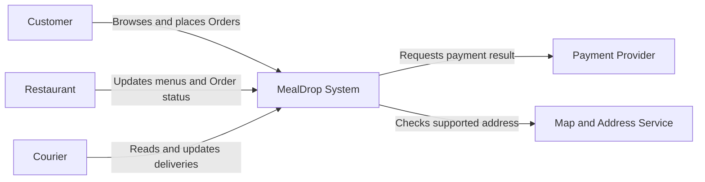

Aici, Restaurant reprezintă persoana care administrează contul Restaurantului.
Payment Provider și Map and Address Service rămân sisteme controlate separat,
chiar dacă MealDrop are nevoie de rezultatele lor.

## 4. Deschide sistemul: Container View

Un **container C4** este o aplicație sau o stocare de date. El nu este neapărat
un container Docker, un server fizic sau un microserviciu.

Exemplul MealDrop folosește aceste părți:

| Container      | Responsabilitate                                                |
| -------------- | --------------------------------------------------------------- |
| Mobile App     | Oferă interfața mobilă pentru Client și Curier                  |
| Web App        | Oferă interfața web pentru Client și Restaurant                 |
| API Gateway    | Primește și direcționează cererile clienților                   |
| Backend Server | Procesează cererile și coordonează rezultatele produsului       |
| Database       | Păstrează Utilizatori, Restaurante, meniuri, Comenzi și livrări |

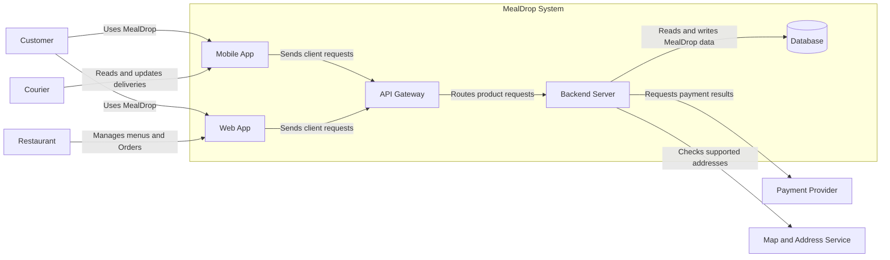

Limita conține același sistem MealDrop care era o singură casetă în System
Context view. Actorii și furnizorii rămân în exterior.

Aceasta este o variantă de proiectare detaliată. Ea presupune aplicații mobile
și web separate și un punct comun de intrare pentru direcționarea cererilor.
API Gateway nu este o cerință C4. Într-o proiectare mai mică, Backend Server
ar putea primi direct cererile clienților.

`Database` lasă tehnologia de stocare nedecisă. Acestea sunt view-uri C4
inițiale: numim întâi responsabilitățile și amânăm alegerea tehnologiilor și a
modului de implementare. Documentația C4 completă poate adăuga aceste alegeri
când sunt cunoscute.

## 5. Deschide o aplicație: view-ul Component

O **componentă** grupează responsabilități înrudite în interiorul unui
container. Deschide numai Backend Server. Păstrează containerele conectate și
furnizorii în afara acestei limite.

| Componentă Backend Server | Responsabilitate                                                        |
| ------------------------- | ----------------------------------------------------------------------- |
| UserService               | Gestionează conturile Utilizatorilor și verificarea identității         |
| RestaurantCatalogService  | Returnează Restaurante, meniuri și disponibilitatea lor                 |
| RestaurantService         | Gestionează profilurile Restaurantelor și modificarea stării Comenzilor |
| OrderService              | Creează Comenzi și coordonează fluxul lor                               |
| CourierService            | Gestionează alocarea livrărilor și schimbarea stărilor                  |
| PaymentService            | Coordonează cererile către Payment Provider                             |
| AddressService            | Coordonează verificările cu Map and Address Service                     |

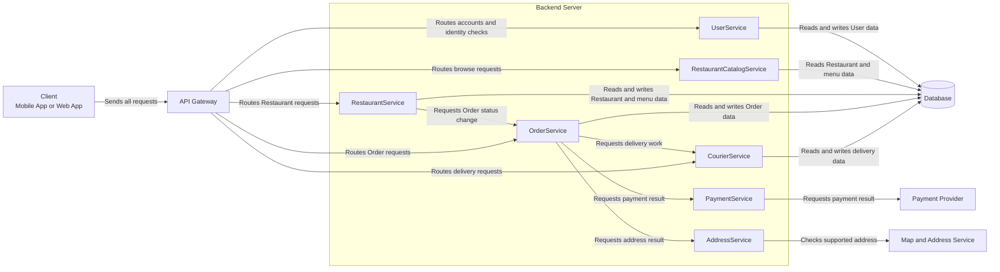

`Client` grupează Mobile App și Web App pentru acest view; nu este un container
nou. El arată cum ajung cererile la API Gateway. Sufixul `Service` numește aici
o componentă. Toate cele șapte componente sunt părți ale aceleiași aplicații
Backend Server.

Această separare dă fiecărei responsabilități a produsului un loc clar. Ea
creează și dependențe: o Comandă poate cere lucru din mai multe componente.
Mutarea fiecărei componente într-o aplicație separată ar adăuga apeluri de
rețea, lucru de implementare și mai multe cazuri de defectare. O asemenea
decizie are nevoie de o justificare proprie.

## 6. Pune verificările de acces pe traseul cererii

- **Autentificare:** Ce Utilizator sau sistem a făcut cererea?
- **Autorizare:** Poate acea identitate să execute acțiunea asupra resursei?

Autentificarea reușită nu permite orice acțiune.

| Cerere                 | Verificarea identității                | Verificarea permisiunii                              |
| ---------------------- | -------------------------------------- | ---------------------------------------------------- |
| Citește o Comandă      | Identifică Clientul                    | Aparține această Comandă Clientului?                 |
| Modifică un meniu      | Identifică Utilizatorul Restaurantului | Poate acest Utilizator să administreze Restaurantul? |
| Actualizează o livrare | Identifică Curierul                    | Este livrarea alocată acestui Curier?                |

În acest exemplu, API Gateway cere UserService să verifice identitatea.
Componenta care gestionează acțiunea verifică permisiunea înainte să citească
sau să modifice date protejate. Respinge o cerere protejată dacă una dintre
verificări eșuează. Răsfoirea publică poate avea o regulă de acces diferită.

## 7. Testează părțile cu fluxuri

View-urile de arhitectură arată structura. O diagramă de secvență arată
interacțiunile în ordinea lor în timp, de sus în jos. O săgeată continuă trimite
o cerere; o săgeată întreruptă returnează un rezultat. Un bloc `alt` separă
rezultatele posibile.

Urmărește trei lucruri: de unde primește date o citire, cum se modifică acele
date și ce se întâmplă când lipsește un rezultat necesar.

### Citire: Clientul răsfoiește Restaurantele

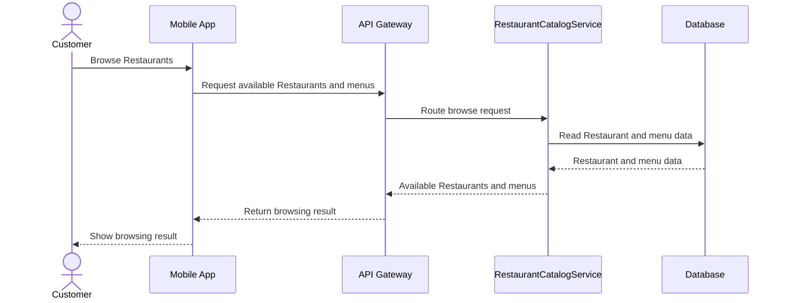

RestaurantCatalogService citește datele stocate. Fluxul următor explică modul
în care disponibilitatea meniului ajunge în acea stocare.

### Scriere: Restaurantul modifică disponibilitatea meniului

Acest flux începe cu o identitate validă. O identitate invalidă trebuie respinsă
înainte ca cererea să ajungă la RestaurantService.

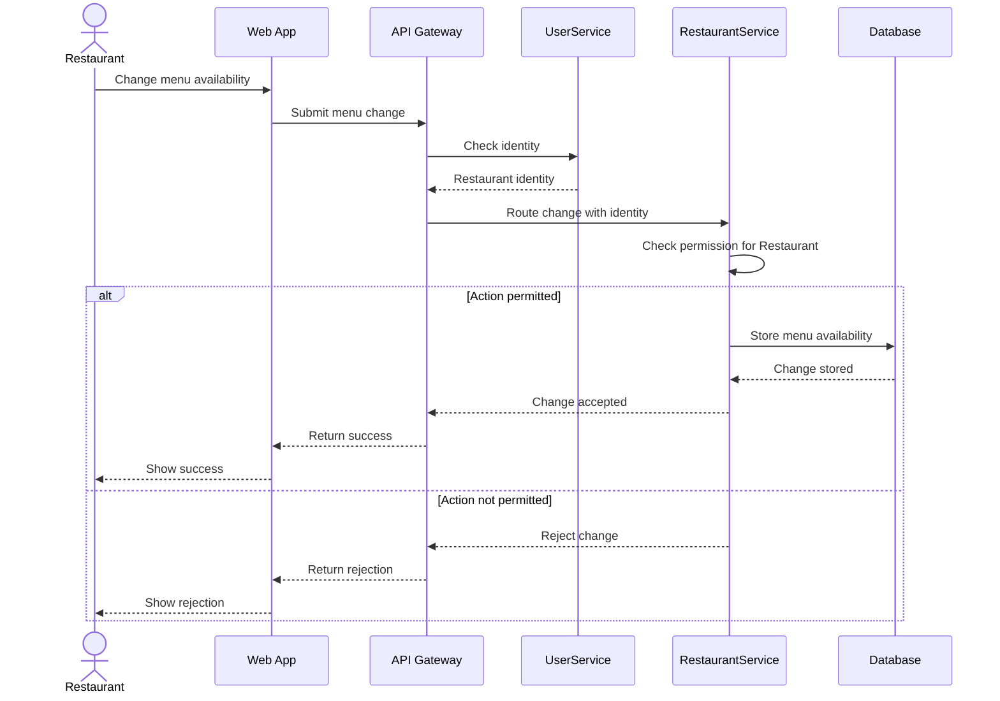

Punctul de succes este modificarea stocată. Verificarea permisiunii are loc
înainte de scriere. O citire ulterioară folosește aceleași date despre
Restaurant și meniu.

### Defectare: rezultatul plății este necunoscut

Acest fragment deschide partea de plată a fluxului unei Comenzi. El presupune
că verificările identității, permisiunii și adresei acceptate au reușit.
Clientul și API Gateway sunt omise; OrderService returnează rezultatul pe
același traseu.

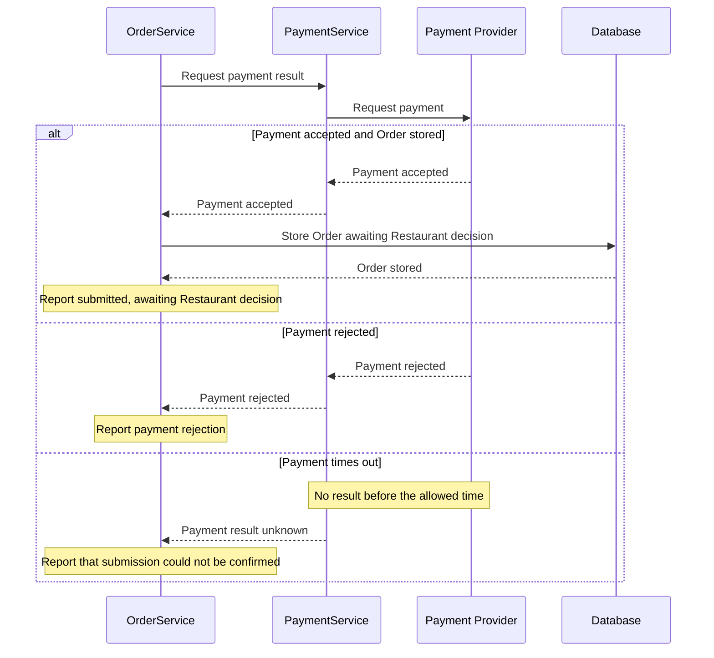

Expirarea timpului de așteptare nu dovedește că plata a reușit sau a eșuat.
De asemenea, aprobarea plății nu înseamnă că Restaurantul a acceptat Comanda.
Păstrează separate aceste rezultate vizibile pentru Utilizator. Dacă plata
reușește, dar stocarea eșuează, MealDrop nu poate afirma că trimiterea Comenzii
a reușit; recuperarea este o întrebare separată de proiectare.

O **limită de defectare** este un punct în care o dependență defectă poate
împiedica obținerea unui rezultat. Această dependență de plată se află pe
traseul Comenzii. Fluxul de răsfoire de mai sus nu o apelează. Această separare
susține o întrebare utilă: poate continua răsfoirea când plata este
indisponibilă? Diagramele singure nu dovedesc acest lucru.

### O decizie de amplasare schimbă fluxul

AddressService poate verifica adresa în timpul plasării unei Comenzi sau când
un Client își modifică contul. Responsabilitatea rămâne aceeași; amplasarea ei
schimbă avantajele și costurile.

| Amplasare                   | Avantaj                                                 | Cost sau risc                                                  |
| --------------------------- | ------------------------------------------------------- | -------------------------------------------------------------- |
| În timpul plasării Comenzii | Folosește un rezultat actual pentru adresă              | Adaugă latența și defectările furnizorului pe traseul Comenzii |
| La modificarea contului     | Oferă răspuns mai devreme și scurtează traseul Comenzii | Rezultatul salvat poate expira sau deveni invalid              |

Dacă folosești rezultatul salvat, definește perioada sa de valabilitate și
invalidează-l când adresa se schimbă. Un rezultat lipsă sau expirat trebuie să
împiedice Comanda până când validarea reușește. Aria acoperită de furnizor se
poate schimba și ea. Ce țintă de calitate favorizează fiecare amplasare?
Numește un caz nou de defectare introdus de folosirea unui rezultat salvat.

## 8. Desenează, previzualizează și revizuiește

Folosește [Mermaid Live Editor](https://mermaid.live/) pentru a previzualiza
sursa. În Markdown, pune diagrama între marcajele de început și de sfârșit ale
blocului de cod:

````markdown
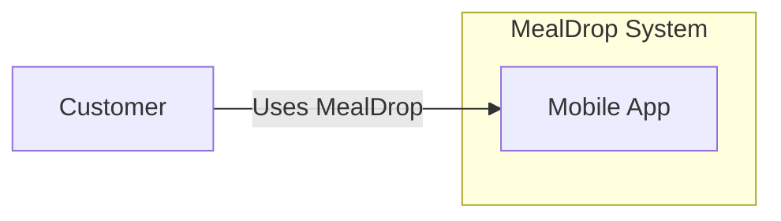
````

- `LR` așază elementele de la stânga la dreapta; `TD` le așază de sus în jos.
- `customer` este un identificator stabil; `Customer` este eticheta vizibilă.
- `-->|"Uses MealDrop"|` etichetează relația cu scopul ei.
- `subgraph` și `end` definesc o limită. `%%` începe un comentariu în sursă.

**Exercițiu:** Schimbă `LR` în `TD`. Adaugă Web App în interiorul limitei și
o relație de la Customer către aceasta. Previzualizează după fiecare schimbare.
Elimină `end`, citește eroarea, apoi pune-l la loc.

## 9. Aprofundare: proiectează Market Data Collector

Dashboard are nevoie de prețuri întârziate și de istoric pentru Stock, de la un
Market Data Provider extern. Utilizatorii pot cere de multe ori același Stock.
Furnizorul are propriile limite pentru cereri, frecvență de actualizare și
defectări.

Rolul colectorului este să transforme răspunsurile furnizorului în date
acceptate, pe care citirile ulterioare din Dashboard le pot folosi. O cerere
reușită către furnizor nu încheie singură acest lucru: răspunsul trebuie să
treacă validarea și să ajungă în stocare.

### Separă citirile Utilizatorilor de sincronizarea cu furnizorul

Compară două opțiuni:

| Opțiune                                                     | Avantaj                                                                | Cost                                                                                                      |
| ----------------------------------------------------------- | ---------------------------------------------------------------------- | --------------------------------------------------------------------------------------------------------- |
| Cere date de la furnizor la fiecare citire a Utilizatorului | Traseu direct și simplu al cererii                                     | Traficul Utilizatorilor consumă cota furnizorului; latența și defectările furnizorului afectează citirile |
| Sincronizează în fundal și citește datele acceptate         | Multe citiri ale Utilizatorilor refolosesc un rezultat al furnizorului | Datele pot îmbătrâni între rulări; sincronizarea trebuie să gestioneze progresul și defectările           |

Pentru acest exemplu, combină verificările periodice în fundal cu
sincronizarea declanșată de cereri. Dashboard Application trimite cererea sa
pentru date de piață către colector. SyncScheduler decide dacă datele stocate
sunt suficiente sau dacă sincronizarea trebuie să se încheie înainte de citire.
Cererile pentru aceeași sincronizare împart lucrul. Datele de autentificare ale
furnizorului rămân în interiorul colectorului.

Această opțiune adaugă un cost: o cerere care are nevoie de sincronizare poate
aștepta acum furnizorul. Dă cererii un termen-limită și returnează
"indisponibil" dacă datele necesare nu pot fi obținute la timp. Proiectarea
care folosește numai sincronizarea în fundal evită această așteptare, dar nu
poate actualiza la cerere datele lipsă sau vechi.

Această alegere se potrivește datelor de piață întârziate. Ea nu face datele
disponibile în timp real și nu elimină întârzierea furnizorului.

### Deschide colectorul: view-ul Component

Presupune un singur proces colector activ. SyncScheduler gestionează atât
cererile de date primite, cât și declanșările programate. El permite cel mult
o sincronizare activă pentru fiecare cheie. Cheia identifică furnizorul, setul
de date și acoperirea cerută: de exemplu, un lot cu ultimele prețuri sau un
interval din istoricul unui Stock și perioada de timp aferentă.

Cererile și declanșările programate care au nevoie de aceeași cheie se alătură
sincronizării existente. Verificarea și înregistrarea lucrului nou trebuie să
aibă loc într-o singură operație, înainte să înceapă sincronizarea. Cheile
diferite nu sunt deduplicate automat, chiar dacă datele lor se suprapun. Mai
multe procese colectoare ar avea nevoie de coordonare comună.

| Componentă       | Responsabilitate                                                                                                |
| ---------------- | --------------------------------------------------------------------------------------------------------------- |
| SyncScheduler    | Deduplică lucrul de sincronizare și alege între citirea datelor stocate sau sincronizare urmată de citire       |
| SyncCoordinator  | Selectează lotul, reia progresul și controlează rularea                                                         |
| ProviderClient   | Adaugă datele de autentificare ale furnizorului, limitează cererile și returnează date sau un defect clasificat |
| RecordValidator  | Verifică și normalizează înregistrările furnizorului                                                            |
| MarketDataReader | Citește acoperirea stocată, momentele furnizorului și datele de piață cerute                                    |
| MarketDataWriter | Salvează în siguranță înregistrările acceptate și progresul sincronizării                                       |

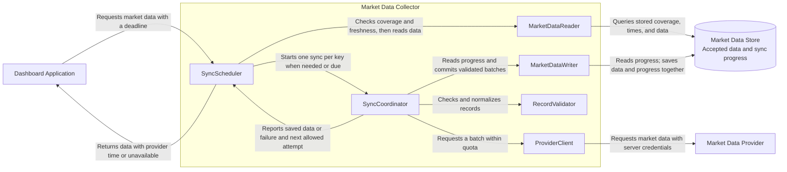

Toate cele șase componente aparțin unei singure aplicații colectoare. Ele nu
trebuie implementate ca șase servicii separate. În această proiectare,
progresul sincronizării este o mică parte din Market Data Store, nu o altă
aplicație.

Pentru o cerere primită, SyncScheduler urmează această decizie:

1. Folosește MarketDataReader pentru a compara acoperirea stocată și momentul
   furnizorului cu intervalul cerut și limita de prospețime.
2. Dacă datele respectă cerința, citește datele stocate și le returnează.
3. Altfel, se alătură unei sincronizări active pentru aceeași cheie. Dacă nu
   există una, pornește o sincronizare numai când cota și intervalul până la
   reîncercare o permit.
4. Așteaptă salvarea datelor relevante, în limita termenului cererii. Apoi
   citește Database prin MarketDataReader și verifică din nou rezultatul.
5. Returnează datele cu momentul furnizorului numai dacă respectă cerința.
   Altfel, returnează "indisponibil". O sincronizare încheiată poate conține
   totuși date vechi.

Dacă verificarea inițială a stocării eșuează, returnează "indisponibil" în loc
să tratezi defectul ca pe o înregistrare lipsă. Nu returna apelantului direct
un răspuns nevalidat al furnizorului. Dacă un apelant încetează să aștepte, el
nu trebuie să anuleze sincronizarea comună de care alți apelanți încă au nevoie.

O sincronizare încheiată stabilește și următorul moment permis pentru
actualizare, pe baza frecvenței de actualizare și a bugetului de cereri ale
furnizorului. Cererile repetate nu trebuie să declanșeze o sincronizare nouă
de fiecare dată când furnizorul returnează aceeași observație veche.

### Fluxul cererii: citește datele stocate sau sincronizează mai întâi

Dashboard Application a verificat identitatea Utilizatorului și datele de
intrare ale cererii. Diagrama arată un singur apelant; alți apelanți pentru
aceeași cheie așteaptă aceeași sincronizare. Lucrul programat folosește aceeași
cheie și nu poate porni o rulare duplicată.

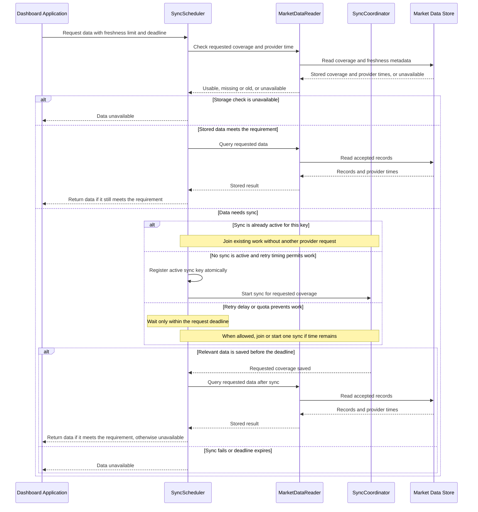

Ambele citiri finale pot eșua sau pot returna date care nu mai respectă limita
de prospețime. În aceste cazuri, returnează "indisponibil". O sincronizare
reușită înseamnă că datele au fost salvate; ea nu dovedește că o citire
ulterioară va reuși.

### Definește ce date pot fi acceptate

RecordValidator verifică dacă Stock este acceptat, câmpurile necesare,
valorile numerice, unitățile și marcajul temporal al furnizorului. De exemplu,
respinge un preț negativ sau un marcaj temporal în afara toleranței convenite
pentru ceas. Un preț lipsă nu este zero.

Păstrează distincte aceste momente:

| Moment                      | Sens                                                          | Ce nu dovedește                                          |
| --------------------------- | ------------------------------------------------------------- | -------------------------------------------------------- |
| Momentul furnizorului       | Când furnizorul a observat valoarea de piață                  | Când Dashboard a preluat-o                               |
| Momentul preluării          | Când colectorul a primit răspunsul                            | Că observația este recentă                               |
| Ultima sincronizare reușită | Când o scanare completă a terminat salvarea datelor acceptate | Că fiecare preț salvat are un moment nou al furnizorului |

Dashboard verifică vechimea prețului pornind de la momentul furnizorului.
Preluarea repetată a aceluiași preț vechi nu trebuie să îl facă să pară mai nou.

Pentru acest exemplu, folosește următoarele reguli de stocare:

- Actualizează ultimul preț numai când observația este mai nouă. Include
  comparația în scriere, astfel încât un răspuns mai vechi să nu poată
  suprascrie o valoare mai nouă.
- Repetarea unei observații identice nu are efect suplimentar. Istoricul
  folosește o identitate stabilă, precum Stock, intervalul și momentul
  furnizorului, pentru a evita dublurile.
- Valorile diferite cu același moment de observare au nevoie de o regulă pentru
  corecțiile sau reviziile furnizorului. Nu decide în tăcere care valoare este
  corectă.
- Salvează lotul și următorul marcaj de progres într-o singură operație
  atomică: ori ambele sunt stocate, ori niciunul. Raportează succesul lotului
  numai după confirmare.
- Salvează numai dacă progresul stocat încă se potrivește cu poziția de început
  a lotului în acea scanare. Altfel, citește din nou progresul. O scriere
  întârziată sau repetată nu trebuie să mute progresul înapoi.

Aceste reguli fac sigură repetarea unui lot. Proprietatea se numește
**idempotență**. Ea contează când colectorul nu poate stabili dacă scrierea
anterioară s-a încheiat.

### Secvența 1: acceptă și salvează un lot

SyncScheduler a pornit o rulare comună, fie de la o cerere de date, fie de la o
declanșare programată. Progresul salvat selectează lotul următor. Pentru prima
rulare, folosește o poziție inițială. Exemplul respinge întregul lot dacă o
înregistrare este invalidă; acest lucru este simplu, dar o înregistrare greșită
poate întârzia datele bune.

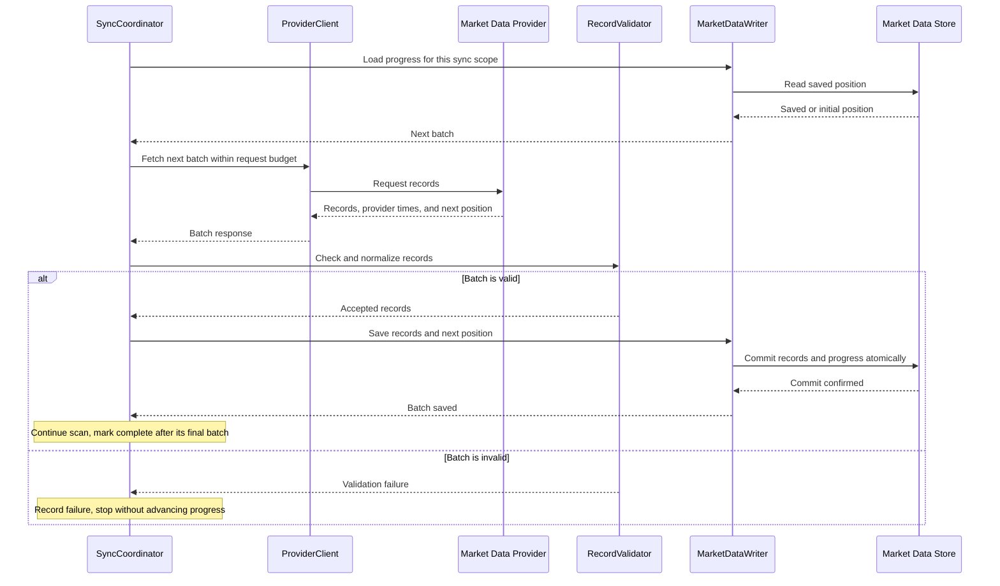

Diagrama presupune că citirea progresului și salvarea reușesc. Dacă citirea
progresului eșuează, oprește rularea. Dacă scrierea nu este confirmată,
folosește fluxul de recuperare de mai jos.

Progresul aparține unui anumit domeniu de date și unei anumite scanări.
Încheierea unei scanări nu oprește sincronizările viitoare: următoarea scanare
programată începe de la propria poziție inițială. Verifică dacă paginarea
furnizorului este stabilă și dacă identificatorii de poziție salvați expiră.
Dacă un asemenea identificator nu mai este valid, reîncepe de la o poziție
acceptată și aplică aceleași reguli de scriere sigură. Nu omite date pe baza
unei poziții ghicite.

### Secvența 2: limitarea cererilor sau expirarea timpului la furnizor

O limitare a cererilor înseamnă că acest client trebuie să reducă sau să amâne
lucrul. Expirarea timpului înseamnă că nu a sosit la timp un rezultat
utilizabil. Niciunul dintre cazuri nu oferă un lot de salvat.

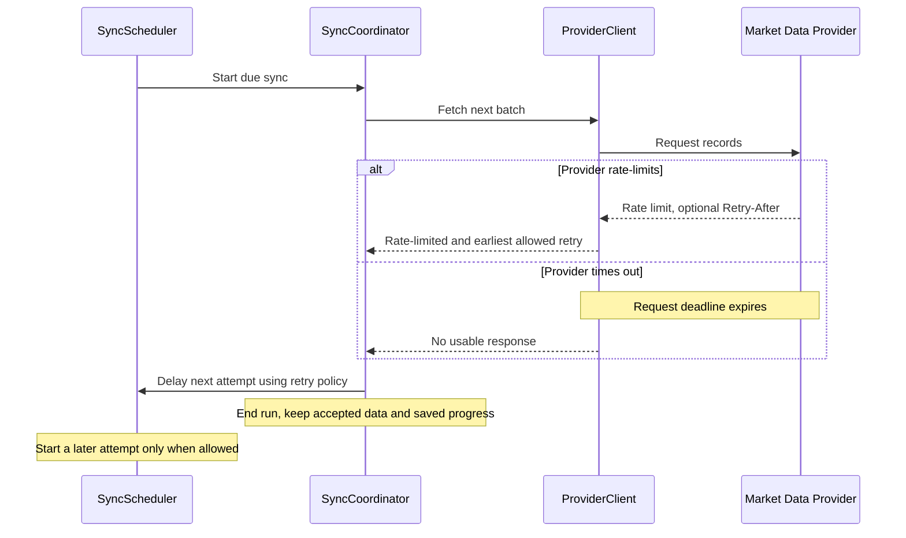

Folosește un timp maxim pentru cerere și un buget limitat de reîncercări.
Defectările repetate trebuie să mărească așteptarea; o mică întârziere
aleatorie, numită **jitter**, împiedică toți clienții să reîncerce simultan.
Dacă furnizorul trimite `Retry-After`, nu reîncerca înainte de acel moment.
Asigură-te că declanșarea programată nu poate ocoli întârzierea. Datele de
autentificare invalide și înregistrările invalide au nevoie de corectare, nu de
încercări rapide și repetate.

Citirile Utilizatorilor pot folosi în continuare prețurile acceptate în limita
lor de prospețime. Pe măsură ce aceste prețuri îmbătrânesc, Dashboard trebuie
să arate întârzierea sau un rezultat indisponibil, conform regulii din
Laboratorul 2. O citire reușită nu dovedește că sincronizarea funcționează bine.
O cerere primită trebuie să respecte aceeași întârziere de reîncercare ca
lucrul programat. Dacă nu poate aștepta suficient pentru date utilizabile,
returnează "indisponibil" în loc să pornești încă o sincronizare. Eliberează
cheia activă când rularea se încheie și păstrează întârzierea de reîncercare.

### Secvența 3: stocarea salvează datele, dar confirmarea se pierde

Presupune că stocarea salvează un lot, dar colectorul se oprește înainte să
primească confirmarea. Salvarea progresului înaintea datelor ar risca să omită
înregistrări lipsă. Salvarea datelor fără repetare sigură ar putea produce
dubluri în istoric.

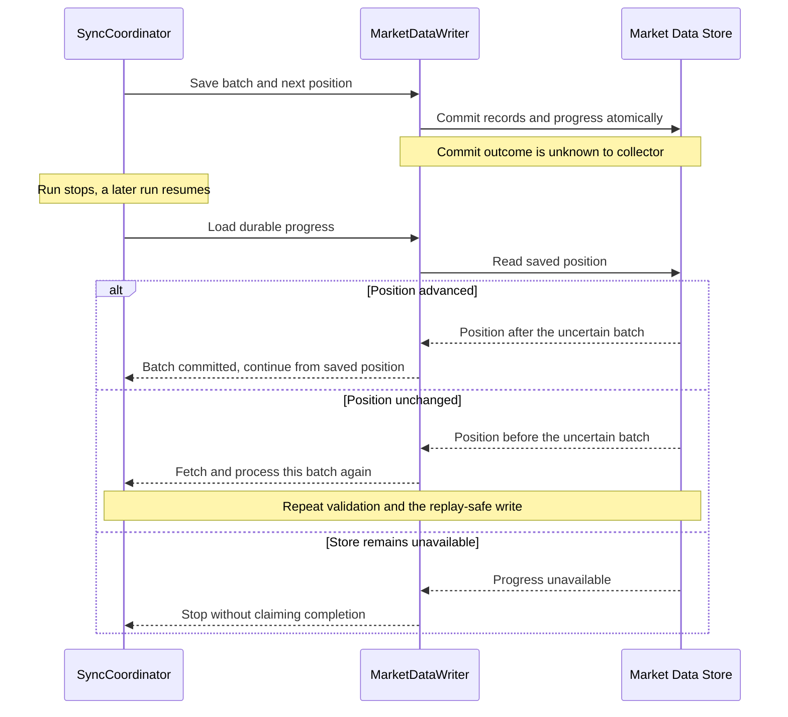

Acest exemplu cere scrieri atomice pentru date și progres, precum și o citire a
progresului care reflectă starea salvată. Acestea sunt cerințe pentru stocare
care trebuie verificate; desenarea unei casete Database nu le dovedește.

### Verifică proiectarea în situații de defectare

Urmărește numărul cererilor, limitările, loturile invalide, durata rulărilor,
progresul salvat și vechimea observațiilor acceptate. Urmărește atât ultima
încercare, cât și ultima sincronizare reușită; încercările repetate pot ascunde
un colector care nu avansează.

Folosește aceste întrebări pentru a testa proiectarea:

1. O rulare durează mai mult decât intervalul ei. Ce împiedică suprapunerea
   lucrului?
2. O înregistrare invalidă blochează un lot. Cum o vei detecta și corecta?
3. Furnizorul returnează din nou prețul de ieri. Ce poate vedea Utilizatorul?
4. Un proces se oprește după o scriere. Ce fapt salvat stabilește de unde se
   reia lucrul?
5. Lucrul pentru istoric consumă cota. Câtă capacitate rămâne pentru ultimele
   prețuri?

Lecturi suplimentare:

- [RFC 6585, secțiunea 4: 429 Too Many Requests](https://datatracker.ietf.org/doc/html/rfc6585#section-4)
  definește răspunsul de limitare a cererilor și antetul opțional `Retry-After`.
- [AWS Builders' Library: timpi de așteptare, reîncercări și pauze cu jitter (PDF)](https://d1.awsstatic.com/builderslibrary/pdfs/timeouts-retries-and-backoff-with-jitter.pdf)
  explică de ce reîncercările au nevoie de limite și de ce o operație
  neconfirmată poate totuși să fi avut efect.

## Referințe: citește cu o întrebare în minte

### Lecturi de bază

Citește-le în această ordine. Paginile C4 sunt scrise de creatorul modelului,
Simon Brown.

1. [C4: introducere](https://c4model.com/introduction).
   Începe cu exemplele de diagrame neclare și cu "Maps of your code".
   **Întrebare:** Ce face o diagramă utilă pentru cineva care nu a desenat-o?
2. Exemple de view-uri C4:
   [System Context](https://c4model.com/diagrams/system-context),
   [Container](https://c4model.com/diagrams/container) și
   [Component](https://c4model.com/diagrams/component).
   Compară exemplele, domeniul de aplicare și elementele principale. Urmează
   aceeași apropiere de la un sistem la un container.
   **Întrebare:** Ce detalii apar sau dispar la fiecare nivel?
3. [Martin Fowler: merită costul unui software de calitate?](https://martinfowler.com/articles/is-quality-worth-cost.html).
   Concentrează-te pe "Internal quality makes it easier to enhance software".
   Aceasta leagă modulele și numele clare de efortul necesar pentru o
   modificare.
   **Întrebare:** Cum ar putea limita PaymentService să ușureze o modificare
   viitoare?

### Explorează mai departe

- [Martin Fowler: începe cu un monolit](https://martinfowler.com/bliki/MonolithFirst.html).
  Citește despre alegerea dintre limite timpurii între servicii și înțelegerea
  domeniului. Fowler precizează și limitele dovezilor. Examinează textul ca pe
  un argument de proiectare, nu ca pe o regulă universală.
  **Întrebare:** Ce dovezi ar justifica implementarea separată a unei componente?
- [OWASP: ghid de autorizare](https://cheatsheetseries.owasp.org/cheatsheets/Authorization_Cheat_Sheet.html).
  Citește "Introduction", "Deny by Default" și "Validate the Permissions on
  Every Request". Lasă detaliile legate de cadrul software pentru etapa de
  implementare.
  **Întrebare:** De ce nu este suficientă identitatea validă a unui Utilizator
  pentru a citi o anumită Comandă?

### Instrumente pentru desenarea diagramelor

- [Diagrame de flux Mermaid](https://mermaid.js.org/syntax/flowchart.html): caută
  nodurile, legăturile etichetate și subgrafurile.
- [Diagrame de secvență Mermaid](https://mermaid.js.org/syntax/sequenceDiagram.html):
  caută participanții, mesajele, notele și blocurile `alt`.
- [GitHub: crearea diagramelor](https://docs.github.com/en/get-started/writing-on-github/working-with-advanced-formatting/creating-diagrams):
  verifică modul în care sunt afișate într-un depozit blocurile de sursă Mermaid.

## Acțiunea următoare

Finalizează [Laboratorul 3: Desenează limita Dashboard](../labs/03-baseline-architecture/README.md).
Folosește cerințele Dashboard și estimările tale din Laboratorul 2 pentru a
crea propria proiectare.

Înainte să desenezi, întreabă:

1. Ce aplicații și stocări sunt necesare și de ce?
2. Ce responsabilități aparțin aplicației de pe server?
3. Ce verificări protejează Watchlist-ul privat al unui Utilizator?
4. Cum ajung datele furnizorului la o citire ulterioară?
5. Ce poate vedea Utilizatorul când datele furnizorului sunt invalide sau
   indisponibile?

Predă trei view-uri de arhitectură și trei diagrame de secvență: sincronizarea
datelor de piață, citirea prețului unui Stock și modificarea unui Watchlist.
Folosește exemplul colectorului pentru a înțelege sincronizarea; adaptează
ipotezele sale la lucrul tău din Laboratorul 2.
