# Lecture 4: Architecture Decomposition and Data Flows

Architecture connects the product requirements to the parts that make the
product work. This guide uses MealDrop to build that connection one step at a
time.

```text
Requirements and design pressure
  -> System Context: the system and its neighbors
  -> Containers: applications and data stores
  -> Components: responsibilities inside one application
  -> Flows: check normal results, access rules, and failures
```

By the end, you should be able to draw these three views, explain why each
part exists, and trace a request to a result that the User can trust.

## 1. From UML to boxes and arrows to C4


### UML: a shared modeling language

In the 1990s, object-oriented methods used different terms and diagram rules.
Grady Booch, Jim Rumbaugh, and Ivar Jacobson combined their methods into the
Unified Modeling Language (UML). The Object Management Group adopted UML 1.1
in 1997.

UML gave teams a common language for structure and behavior. Class diagrams
show types and relationships. Sequence diagrams show interactions over time.
The shared notation reduces ambiguity, but teams must learn its rules and
choose the diagrams they need.

Source: [OMG: UML history](https://www.omg.org/uml/why-uml-is-important.htm).

### Boxes and arrows: easy to draw, easy to misunderstand

Simon Brown describes a shift in the teams he worked with: less UML and more
informal diagrams on whiteboards and in drawing tools. These diagrams were
quick to create and change, but their meaning was often unclear.

```text
[Application] ---> [Database]
```

- Is Application a whole system, a running application, or a code module?
- Does the arrow mean reads, writes, or depends on?
- Which details are hidden?

Simple shapes work well when the author explains what they represent.
Without that explanation, two readers can interpret the same picture differently.

### C4: simple diagrams with clear levels of detail

Brown developed C4 through architecture workshops in the mid-2000s. The four
levels appeared in 2010; the C4 name followed in 2011.

C4 keeps simple boxes and arrows and gives them a structure:

- **System Context:** the system, its Users, and its external dependencies.
- **Container:** applications and data stores inside the system.
- **Component:** parts inside one container.
- **Code:** implementation details inside one component.

Each view opens one boundary and answers a different question. Names, types,
and relationship labels explain what the boxes and arrows mean.

Source: [Simon Brown: C4 history](https://c4model.com/history).

All three approaches are used today. Boxes and arrows existed before UML,
and C4 can use UML notation. Learn the purpose and basic notation of useful
UML diagrams: class diagrams for structure, sequence diagrams for interactions,
and state diagrams for states and transitions.

When drawing, aim for clarity. Use enough notation to explain the design;
do not add formal detail that makes the main point harder to understand.
Keep the meaning of the symbols you use consistent.

This is a tradeoff between implicit and explicit knowledge:

- **Implicit:** a familiar symbol carries meaning that the reader already
knows. This keeps the diagram compact but assumes shared knowledge.
- **Explicit:** labels, notes, and a small legend explain the meaning directly.
This helps unfamiliar readers but adds more text to the diagram.

For example, a UML arrow can express a specific relationship without a long
label when both readers know its meaning. For a broader audience, name the
relationship and explain unfamiliar symbols. Make the important meaning clear
without requiring the reader to guess.

## 2. Choose the question before drawing the view

C4 gives you four levels of detail. Think of a map: first locate a building,
then open its floor plan, then inspect one room. The analogy is about zoom.


| C4 view        | Question                                                   | MealDrop example                         |
| -------------- | ---------------------------------------------------------- | ---------------------------------------- |
| System Context | Who uses the system, and which other systems does it need? | MealDrop, its actors, and its providers  |
| Container      | Which applications and data stores make it work?           | Mobile App, Backend Server, Database     |
| Component      | How is one container divided into responsibilities?        | OrderService inside Backend Server       |
| Code           | How is one component implemented?                          | Classes or functions inside OrderService |


Keywords:

- **Model:** concepts and relationships used to describe a system. C4 is a model.
- **View:** a selected part of that model that answers a question.
- **Notation:** what shapes, lines, and labels mean. UML is a standardized
modeling language with defined notation. C4 can use UML or simple labeled boxes.
- **Diagram:** a visual presentation of a view.
- **Syntax:** the text used by a tool to draw the diagram. Mermaid supplies syntax.


## 3. Start outside: the System Context view

Customers browse and place Orders. Restaurants
change menus and handle Orders. Couriers handle assigned deliveries.

Treat MealDrop as one system. Show people, external systems, and the reason
for each relationship. Keep all internal applications and stores hidden.

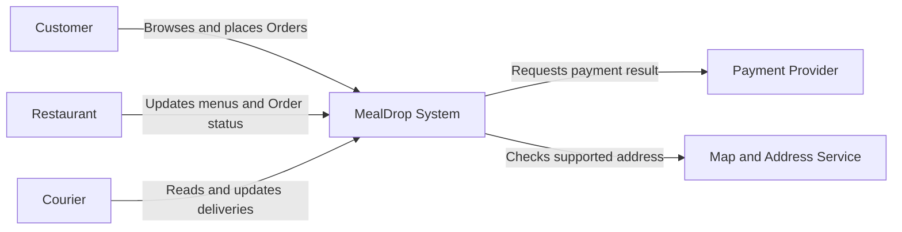


Here, Restaurant means the person who operates the Restaurant account.
Payment Provider and Map and Address Service remain separately controlled
systems even though MealDrop needs their results.

## 4. Open the system: the Container view

A **C4 container** is an application or a data store. It is not necessarily a
Docker container, one physical server, or one microservice.

The MealDrop example uses these parts:


| Container      | Responsibility                                            |
| -------------- | --------------------------------------------------------- |
| Mobile App     | Provides the Customer and Courier mobile interface        |
| Web App        | Provides the Customer and Restaurant web interface        |
| API Gateway    | Receives and routes client requests                       |
| Backend Server | Processes requests and coordinates product results        |
| Database       | Retains Users, Restaurants, menus, Orders, and deliveries |


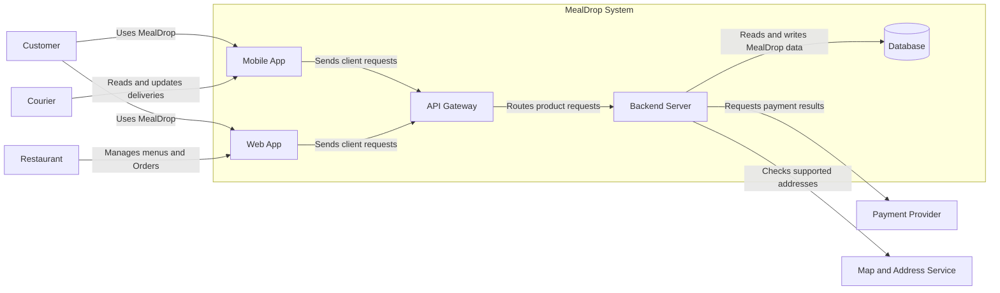


The boundary contains the same MealDrop system that was one box in the
System Context view. The actors and providers stay outside it.

This is one worked design. It assumes separate mobile and web applications
and a common routing entry point. An API Gateway is not a C4 requirement.
In a smaller design, the Backend Server could receive client requests directly.

`Database` leaves the storage technology undecided. These are early C4 views:
we name responsibilities first and defer technology and deployment choices.
Full C4 documentation can add those choices when they are known.

## 5. Open one application: the Component view

A **component** groups related responsibilities inside one container. Open
only Backend Server. Keep connected containers and providers outside that
boundary.


| Backend Server component | Responsibility                                       |
| ------------------------ | ---------------------------------------------------- |
| UserService              | Handles User accounts and identity checks            |
| RestaurantCatalogService | Returns Restaurants, menus, and availability         |
| RestaurantService        | Handles Restaurant profiles and Order-status actions |
| OrderService             | Creates Orders and coordinates their workflow        |
| CourierService           | Handles delivery assignments and status changes      |
| PaymentService           | Coordinates requests to the Payment Provider         |
| AddressService           | Coordinates checks with the Map and Address Service  |


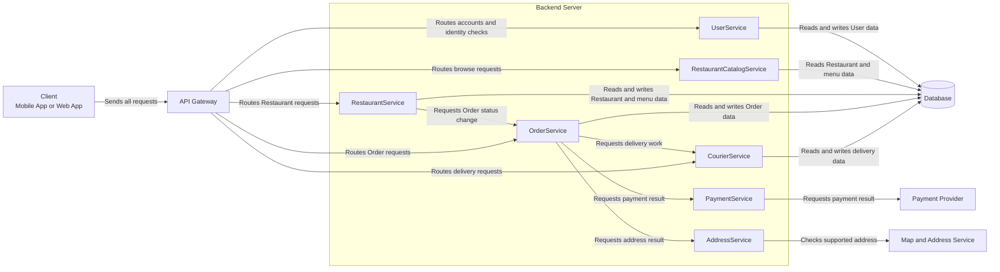


`Client` groups Mobile App and Web App for this view; it is not a new
container. It shows how requests reach API Gateway. The `Service` suffix names
a component here. All seven components are parts of the same Backend Server
application.

This separation gives each product responsibility a clear location. It also
creates dependencies: an Order can require work from several components.
Moving each component into a separate application would add network calls,
deployment work, and more failure cases. That needs its own justification.

## 6. Put access checks on the request path

- **Authentication:** Which User or system made the request?
- **Authorization:** May that identity perform this action on this resource?

Successful sign-in does not permit every action.


| Request           | Identity check               | Permission check                           |
| ----------------- | ---------------------------- | ------------------------------------------ |
| Read an Order     | Identify the Customer        | Does this Order belong to that Customer?   |
| Change a menu     | Identify the Restaurant User | Can this User manage this Restaurant?      |
| Update a delivery | Identify the Courier         | Is this delivery assigned to that Courier? |


In this example, API Gateway asks UserService to check identity. The component
that handles the action checks permission before it reads or changes protected
data. Reject a protected request if either check fails. Public browsing can
have a different access rule.

## 7. Test the parts with flows

The architecture views show structure. A sequence diagram shows interactions
in time order, from top to bottom. A solid arrow below sends a request; a
dashed arrow returns a result. An `alt` block separates possible outcomes.

Trace three things: where a read gets its data, how that data changes, and
what happens when a required result is missing.

### Read: Customer browses Restaurants

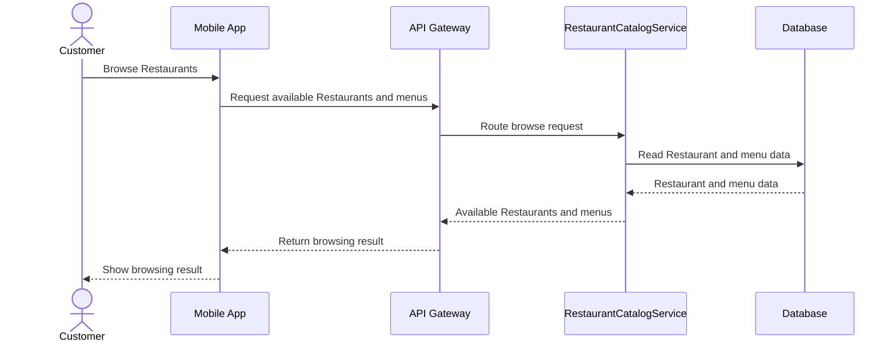


RestaurantCatalogService reads stored data. The next flow explains how menu
availability reaches that store.

### Write: Restaurant changes menu availability

This flow starts with a valid identity. An invalid identity must be rejected
before the request reaches RestaurantService.

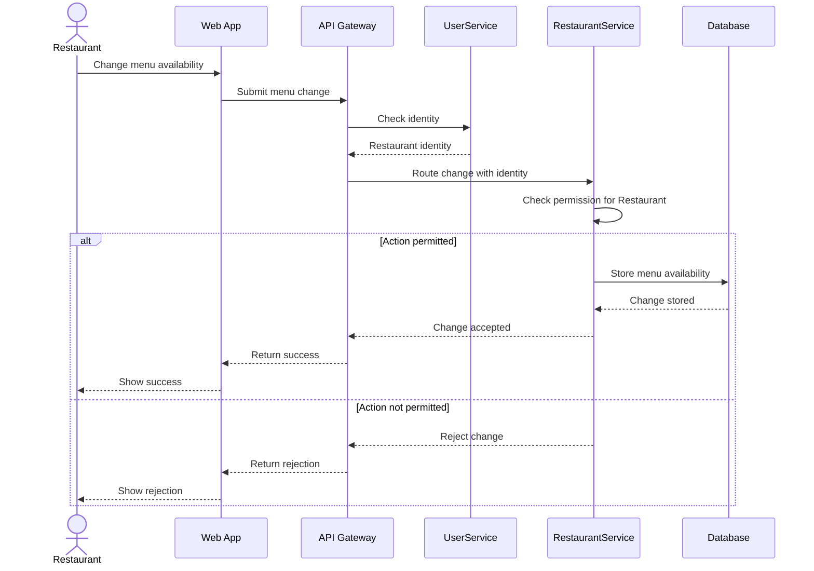


The success point is the stored change. The permission check comes before
the write. A later browse uses the same Restaurant and menu data.

### Failure: the payment result is unknown

This excerpt opens the payment part of an Order flow. It assumes identity,
permission, and supported-address checks have passed. The client and API
Gateway are omitted; OrderService returns its result through that same path.

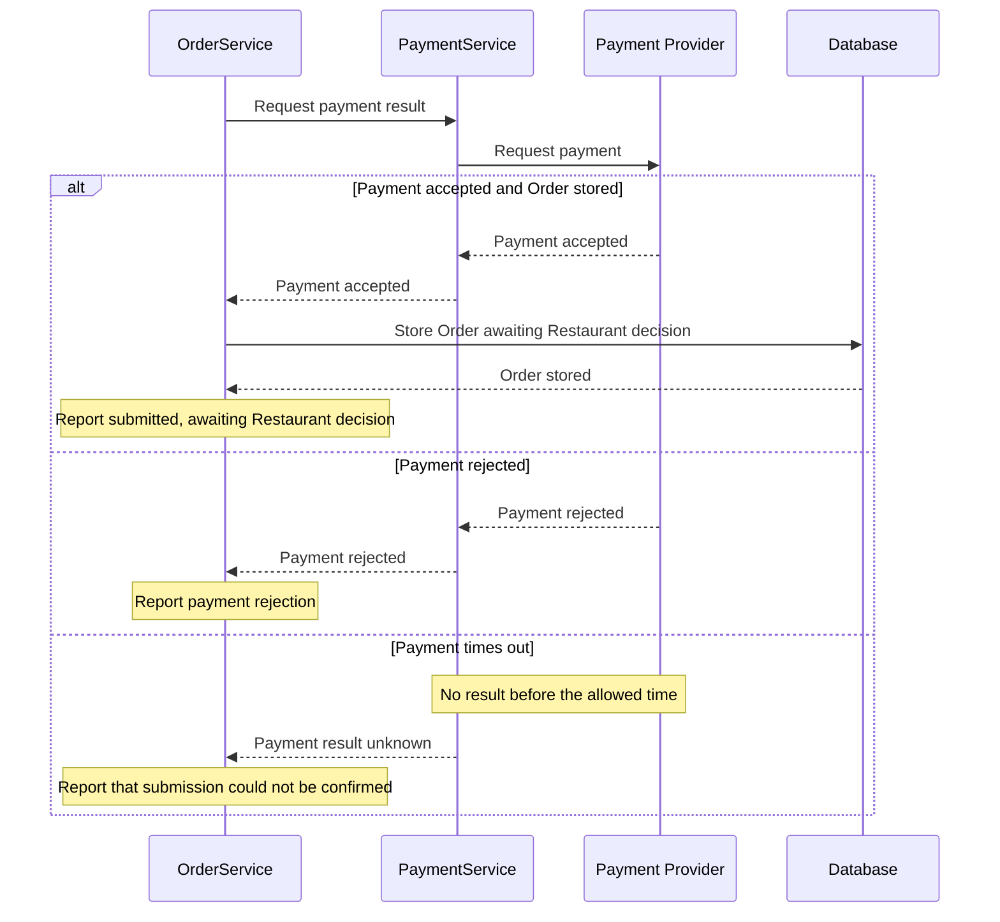


A timeout does not prove that payment succeeded or failed. Also, payment
approval alone does not mean the Restaurant accepted the Order. Keep these
User-visible results separate. If payment succeeds but storage fails, MealDrop
also cannot claim successful submission; recovery is a separate design question.

A **failure boundary** is a point where a failed dependency can prevent a
result. This payment dependency is on the Order path. The browse flow above
does not call it. That separation supports a useful question: can browsing
continue while payment is unavailable? The diagrams alone do not prove it.

### A placement decision changes the flow

AddressService can check the address during an Order or when a Customer edits
the account. The responsibility remains; its placement changes the tradeoff.


| Placement              | Benefit                                            | Cost or risk                                        |
| ---------------------- | -------------------------------------------------- | --------------------------------------------------- |
| During the Order       | Uses a current address result                      | Adds provider latency and failure to the Order path |
| During account editing | Gives earlier feedback and shortens the Order path | The saved result can expire or become invalid       |


If you use the saved result, define its validity period and invalidate it when
the address changes. A missing or expired result must prevent the Order until
validation succeeds. Provider coverage can also change.
Which quality target favors each placement? Name one new failure
case introduced by using a saved result.

## 8. Draw, preview, and review

Use [Mermaid Live Editor](https://mermaid.live/) to preview the source.
In Markdown, put the diagram between opening and closing code fences:

````markdown
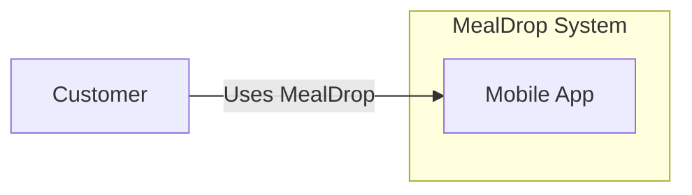
````

- `LR` lays out left to right; `TD` lays out top to bottom.
- `customer` is a stable identifier; `Customer` is the visible label.
- `-->|"Uses MealDrop"|` labels the relationship with its purpose.
- `subgraph` and `end` define a boundary. `%%` starts a source comment.

**Practice:** Change `LR` to `TD`. Add Web App inside the boundary and a
Customer relationship to it. Preview after each change. Remove `end`, read
the error, then restore it.

## 9. Deeper dive: design the Market Data Collector

The Dashboard needs delayed Stock prices and history from an external Market
Data Provider. Users can request the same Stock many times. The provider has
its own request limits, update frequency, and failures.

The collector's job is to turn provider responses into accepted data that
later Dashboard reads can use. A successful provider request alone does not
complete that job: the response must pass validation and reach storage.

### Separate User reads from provider sync

Compare two choices:

| Choice                                        | Benefit                                   | Cost                                                                             |
| --------------------------------------------- | ----------------------------------------- | -------------------------------------------------------------------------------- |
| Fetch from the provider for each User read    | Simple direct request path                | User traffic consumes provider quota; provider latency and failures affect reads |
| Sync in the background and read accepted data | Many User reads reuse one provider result | Data can age between runs; sync needs progress and failure handling              |

For this walkthrough, combine background polling with request-triggered sync.
The Dashboard Application sends its market-data request to the collector.
SyncScheduler decides whether stored data can satisfy it or whether sync must
finish before the data is read. Requests for the same sync scope share work.
Provider credentials stay inside the collector.

This adds a tradeoff: a request that needs sync can now wait on the provider.
Give the request a deadline and return unavailable if the required data cannot
be obtained in time. The background-only design above avoids that wait but
cannot refresh missing or old data on demand.

This choice fits delayed market data. It does not make the data live or remove  
the provider's own delay.

### Open the collector: Component view

Assume one active collector process. SyncScheduler handles both incoming data
requests and scheduled triggers. It permits at most one active sync per key.
The key identifies the provider, dataset, and requested coverage: for example,
a latest-price batch or a Stock's history interval and time window.

Requests and scheduled triggers that need the same key join the existing sync.
The check and registration of new work must happen as one operation, before
the sync starts. Different keys are not automatically deduplicated, even when
their data overlaps. Multiple collector processes would need shared coordination.

| Component        | Responsibility                                                                       |
| ---------------- | ------------------------------------------------------------------------------------ |
| SyncScheduler    | Deduplicates sync work and chooses stored reads or sync followed by a read            |
| SyncCoordinator  | Selects the batch, resumes progress, and controls the run                            |
| ProviderClient   | Adds provider credentials, limits requests, and returns data or a classified failure |
| RecordValidator  | Checks and normalizes provider records                                               |
| MarketDataReader | Reads stored coverage, provider times, and requested market data                      |
| MarketDataWriter | Saves accepted records and sync progress safely                                      |

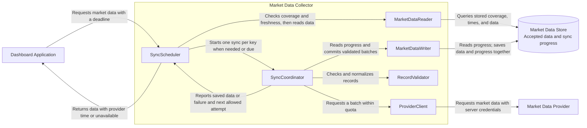

All six components belong to one collector application. They do not need
six separately deployed services. Sync progress is a small part of the Market
Data Store in this design, not another application.

For an incoming request, SyncScheduler follows this decision:

1. Use MarketDataReader to check stored coverage and provider time against the
   requested range and freshness limit.
2. If the data meets the requirement, query the stored data and return it.
3. Otherwise, join an active sync for the same key. If none exists, start one
   only when quota and retry timing permit it.
4. Wait for the relevant data to be saved, within the request deadline. Then
   query the Database through MarketDataReader and check the result again.
5. Return data with its provider time only if it meets the requirement.
   Otherwise return unavailable. A completed sync can still contain old data.

If the initial storage check fails, return unavailable rather than treating
the failure as a missing record. Do not return an unvalidated provider response
directly to the caller. If one caller stops waiting, it must not cancel shared
sync work that other callers still need.

A completed sync also sets the next eligible refresh time from the provider's
update frequency and request budget. Repeated requests must not trigger a new
sync each time the provider returns an unchanged, old observation.

### Request flow: read stored data or sync first

The Dashboard Application has checked User identity and request input. The
diagram shows one caller; other callers for the same key wait on the same sync.
Scheduled work uses that same key and cannot start a duplicate run.

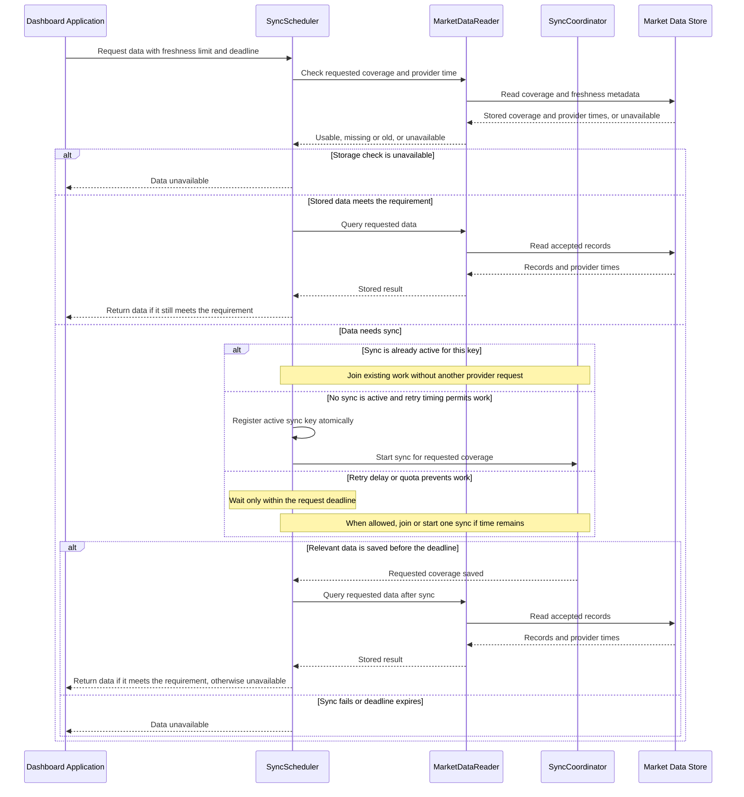

Both final reads can fail or return data that no longer meets the freshness
limit. Return unavailable in those cases. Successful sync means data was saved;
it does not prove that a subsequent read will succeed.

### Define what can be accepted

RecordValidator checks the supported Stock, required fields, numeric values,
units, and provider timestamp. For example, reject a negative price or a
timestamp outside the agreed clock tolerance. A missing price is not zero.

Keep these times distinct:

| Time                 | Meaning                                            | What it does not prove                         |
| -------------------- | -------------------------------------------------- | ---------------------------------------------- |
| Provider time        | When the provider observed the market value        | When the Dashboard fetched it                  |
| Fetch time           | When the collector received the response           | That the observation is recent                 |
| Last successful sync | When a full scan finished saving its accepted data | That every saved price has a new provider time |

The Dashboard checks price age from provider time. Fetching the same old price
again must not make it appear newer.

For this example, use these storage rules:

- Update a latest price only when the observation is newer. Make this comparison
part of the write so an older response cannot overwrite a newer value.
- Repeating an identical observation has no additional effect. History uses a
stable identity, such as Stock, interval, and provider time, to avoid duplicates.
- Conflicting values with the same observation time need a provider correction
or revision rule. Do not silently decide which value is correct.
- Save the batch and its next progress marker in one atomic operation: both
become stored, or neither does. Report batch success only after confirmation.
- Commit only if saved progress still matches the batch's starting position
in that scan. Otherwise, read progress again. A late or repeated write must
not move progress backward.

These rules make a repeated batch safe. This property is called **idempotency**.
It matters when the collector cannot tell whether its previous write completed.

### Sequence 1: accept and save one batch

SyncScheduler has started one shared run, from a data request or a due trigger.
The saved progress selects the next batch.
For a first run, use an initial position. The example rejects the whole batch
if any record is invalid; this is simple, but one bad record can delay good data.

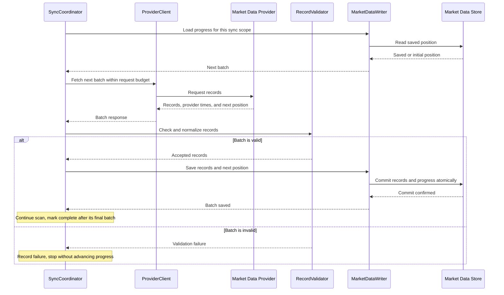

This diagram assumes the progress read and commit succeed. On a failed progress
read, stop the run. On an unconfirmed write, use the recovery flow below.

Progress belongs to a specific data scope and scan. Finishing a scan does not
stop future syncs: the next scheduled scan starts from its own initial position.
Check whether provider pagination is stable and whether saved cursors expire.
If a cursor is no longer valid, restart from a supported position and use the
same safe-write rules. Do not skip data based on a guessed position.

### Sequence 2: provider rate limit or timeout

A rate limit means the client must reduce or delay work. A timeout means no
usable result arrived in time. Neither case supplies a batch to save.

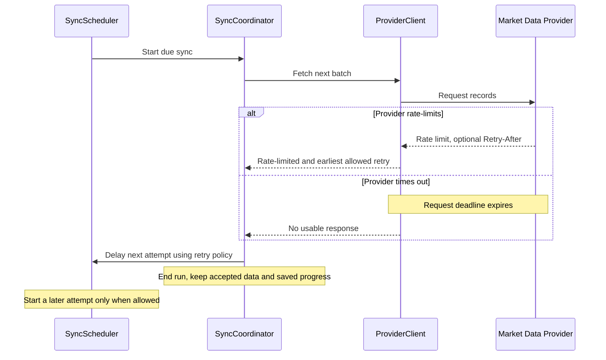

Use a request timeout and a bounded retry budget. Repeated failures should
increase the wait; a small random delay, called **jitter**, prevents clients
from retrying together. If the provider sends `Retry-After`, do not retry before
that time. Ensure the scheduled trigger cannot bypass the delay. Invalid
credentials or invalid records need correction, not rapid repeated attempts.

User reads can still use accepted prices within their freshness limit. As
those prices age, the Dashboard must show the delay or an unavailable result
according to its Lab 2 rule. A successful read does not prove sync is healthy.
An incoming request must respect the same retry delay as scheduled work. If it
cannot wait long enough for usable data, return unavailable rather than starting
another sync. Release the active key when a run ends, and retain its retry delay.

### Sequence 3: storage commits, but confirmation is lost

Suppose storage saves a batch, but the collector stops before it receives the
confirmation. Saving progress before data would risk skipping missing records.
Saving data without safe replay could produce duplicate history.

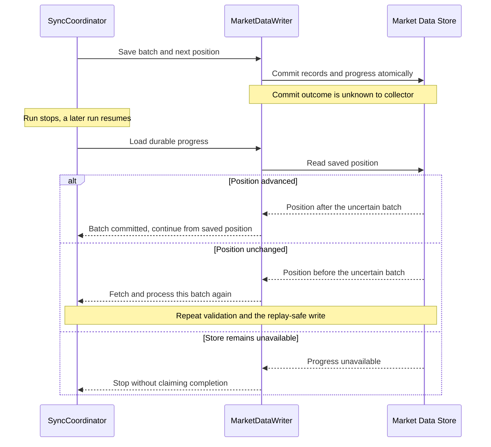

This example requires atomic data-and-progress writes and a progress read
that reflects committed state. Those are storage requirements to verify,
not properties established by drawing a Database box.

### Check the design against failures

Track request count, rate limits, invalid batches, run duration, saved progress,
and the age of accepted observations. Track both last attempt and last
successful sync; repeated attempts can hide a collector that makes no progress.

Use these questions to test the design:

1. A run takes longer than its interval. What prevents overlapping work?
2. One invalid record blocks a batch. How will you detect and correct it?
3. The provider returns yesterday's price again. What may the User see?
4. A process stops after a write. Which saved fact decides where work resumes?
5. History work uses the quota. How much capacity remains for latest prices?

Further reading:

- [RFC 6585, section 4: 429 Too Many Requests](https://datatracker.ietf.org/doc/html/rfc6585#section-4)
defines the rate-limit response and its optional `Retry-After` header.
- [AWS Builders' Library: Timeouts, retries, and backoff with jitter (PDF)](https://d1.awsstatic.com/builderslibrary/pdfs/timeouts-retries-and-backoff-with-jitter.pdf)
explains why retries need limits and why an unconfirmed operation can still
have taken effect.

## References: read with a question


### Core reading

Read these in order. The C4 pages are by its creator, Simon Brown.

1. [C4: Introduction](https://c4model.com/introduction).
  Start with the unclear-diagram examples and "Maps of your code."
   **Question:** What makes a diagram useful to someone who did not draw it?
2. C4 worked views:
  [System Context](https://c4model.com/diagrams/system-context),
   [Container](https://c4model.com/diagrams/container), and
   [Component](https://c4model.com/diagrams/component).
   Compare the examples, scope, and primary elements. Follow the same zoom
   from one system into one container.
   **Question:** Which details appear or disappear at each level?
3. [Martin Fowler: Is High Quality Software Worth the Cost?](https://martinfowler.com/articles/is-quality-worth-cost.html).
  Focus on "Internal quality makes it easier to enhance software."
   This connects clear modules and names to the effort needed for a change.
   **Question:** How could the PaymentService boundary make a future change easier?


### Explore further

- [Martin Fowler: Monolith First](https://martinfowler.com/bliki/MonolithFirst.html).
Read the tradeoff between early service boundaries and learning the domain.
Fowler also states the limits of the evidence. Treat this as a design
argument to examine, not a universal rule.
**Question:** What evidence would justify deploying a component separately?
- [OWASP: Authorization Cheat Sheet](https://cheatsheetseries.owasp.org/cheatsheets/Authorization_Cheat_Sheet.html).
Read "Introduction," "Deny by Default," and "Validate the Permissions on
Every Request." Leave framework details for implementation work.
**Question:** Why is a valid User identity insufficient to read a selected Order?


### Tools to use while drawing

- [Mermaid flowcharts](https://mermaid.js.org/syntax/flowchart.html): look up
nodes, labeled links, and subgraphs.
- [Mermaid sequence diagrams](https://mermaid.js.org/syntax/sequenceDiagram.html):
look up participants, messages, notes, and `alt` blocks.
- [GitHub: Creating diagrams](https://docs.github.com/en/get-started/writing-on-github/working-with-advanced-formatting/creating-diagrams):
check how fenced Mermaid source renders in a repository.


## Next action

Complete [Lab 3: Draw the Dashboard Boundary](../labs/03-baseline-architecture/README.md).
Use the Dashboard requirements and your Lab 2 estimates to make your own design.

Before drawing, ask:

1. Which applications and stores are needed, and why?
2. Which responsibilities belong inside the server-side application?
3. Which checks protect a User's private Watchlist?
4. How does provider data reach a later read?
5. What can the User see when provider data is invalid or unavailable?

Submit three architecture views and three sequence diagrams: market-data sync,
a Stock-price read, and a Watchlist change. Use the collector walkthrough to
reason about sync; adapt its assumptions to your Lab 2 work.
