# Lecția 5: Scalarea orizontală, memoria cache și disponibilitatea

Lecția 4 a dat sistemului MealDrop un Backend Server și o bază de date. Lecția 3 a
stabilit o presiune măsurată: o instanță Backend Server poate gestiona în siguranță
250 de cereri pe secundă (RPS), dar ținta de vârf este de 704 RPS. O instanță se
poate și opri.

Acest ghid urmează un singur traseu de decizie:

```text
încărcare măsurată sau defectare
  -> alege un mecanism de scalare
  -> stabilește unde se păstrează starea necesară
  -> definește rezultatul vizibil pentru Utilizator
  -> testează întregul traseu al cererii
```

La final, ar trebui să poți stabili numărul de instanțe ale serviciului, să explici
când ajută replicile bazei de date și când pot rămâne în urmă și să definești un
cache sigur pentru citiri repetate.
Numerele din acest ghid sunt ipoteze didactice, nu date din producție.

## 1. Alege presiunea înaintea mecanismului

**Scalabilitatea** înseamnă păstrarea țintelor de calitate alese atunci când se
schimbă volumul de lucru. Nu înseamnă că fiecare cerere este rapidă la orice încărcare.

| Presiune                                                    | Primul pas posibil                                            | Limită de verificat                                                       |
| ----------------------------------------------------------- | ------------------------------------------------------------- | ------------------------------------------------------------------------- |
| O instanță nu are suficient CPU sau suficientă memorie      | Dă-i mai multe resurse: scalare verticală                     | Un proces se poate defecta în continuare; o unitate mai mare are o limită |
| O instanță nu poate gestiona încărcarea țintă               | Adaugă instanțe echivalente: scalare orizontală               | Dependențele comune pot deveni punctul de blocaj                          |
| Defectarea unui proces oprește procesarea tuturor cererilor | Păstrează încă o instanță pregătită                           | Aceasta are nevoie de acces la starea necesară                            |
| Capacitatea de citire a bazei de date este saturată         | Măsoară, optimizează sau adaugă copii potrivite pentru citire | Copiile datelor trebuie să primească actualizări și pot rămâne în urmă    |

Un distribuitor de trafic (load balancer) direcționează traficul către o instanță
a serviciului. Politica sa de verificare a stării ar trebui să evite instanțele
care nu pot servi cereri. Acesta nu creează capacitate de procesare. Nici patru
instanțe ale serviciului nu creează patru copii ale datelor durabile MealDrop.

Termenul **replică** are două utilizări diferite:

- O **replică a serviciului** rulează aceeași aplicație. Cererile pot ajunge la
  orice instanță dacă starea necesară pentru o cerere ulterioară nu există doar
  într-un singur proces.
- O **replică a datelor** păstrează o copie a datelor stocate. Poate servi citiri
  potrivite sau poate ajuta după defectarea unui nod de date, dar trebuie să
  primească actualizările acceptate. Replicarea nu crește automat capacitatea de scriere.

O bază de date poate primi mai multe resurse și fără replici de date suplimentare.
Măsoară ce resursă sau operație o limitează înainte să alegi o schimbare.

**Verifică:** Patru instanțe Backend Server sunt inactive, dar fiecare cerere de
consultare a listei așteaptă o bază de date saturată. Ce parte ar trebui să măsori în continuare?

### Ce poate inspecta un distribuitor de trafic?

| Nivel          | Ce poate folosi                                           | Exemplu MealDrop                                     | Limită                                                                                    |
| -------------- | --------------------------------------------------------- | ---------------------------------------------------- | ----------------------------------------------------------------------------------------- |
| Nivelul 4 (L4) | Detalii de transport, precum adrese și porturi            | Trimite o conexiune TCP la o instanță Backend Server | Nu poate ruta după calea HTTP; mai multe cereri pot folosi aceeași conexiune              |
| Nivelul 7 (L7) | Detalii ale cererii HTTP, precum gazda, calea și antetele | Rutează diferit `/restaurants` și `/orders`          | Trebuie să citească mesajul HTTP; pentru HTTPS, aceasta înseamnă de obicei terminarea TLS |

L4 poate transmite traficul criptat către un backend. L7 poate alege pentru
fiecare cerere HTTP. **Nivelul** arată ce poate inspecta distribuitorul.
**Metoda de selecție** arată cum alege dintre instanțele potrivite. Nu le confunda.

API Gateway și distribuitorul de trafic sunt roluri pe care un singur proxy le
poate combina. MealDrop le combină în containerul API Gateway: Gateway-ul rutează
cererile produsului și selectează o instanță Backend Server.

### Cum alege o instanță?

| Metodă                                       | Regulă                                               | Când este utilă                                                                         | Limita principală                                                                                              |
| -------------------------------------------- | ---------------------------------------------------- | --------------------------------------------------------------------------------------- | -------------------------------------------------------------------------------------------------------------- |
| Round robin                                  | Folosește instanțele pe rând                         | Cererile au costuri similare                                                            | Un număr egal de cereri poate însemna totuși un volum inegal de muncă                                          |
| După încărcare, de exemplu least connections | Preferă instanța cu cele mai puține conexiuni active | Unele cereri mențin conexiunile mai mult timp                                           | Numărul de conexiuni este doar un indicator indirect al încărcării CPU sau al altei încărcări                  |
| După hash                                    | Asociază aceeași cheie cu aceeași instanță           | Păstrează cererile repetate ale unui client pe o instanță când este necesară afinitatea | IP-urile comune pot concentra Utilizatorii; schimbările de IP sau defectarea instanțelor pot schimba asocierea |

#### Round robin

Fiecare cerere nouă ajunge la următoarea instanță. Cu patru instanțe egale,
a cincea cerere revine la instanța 1.

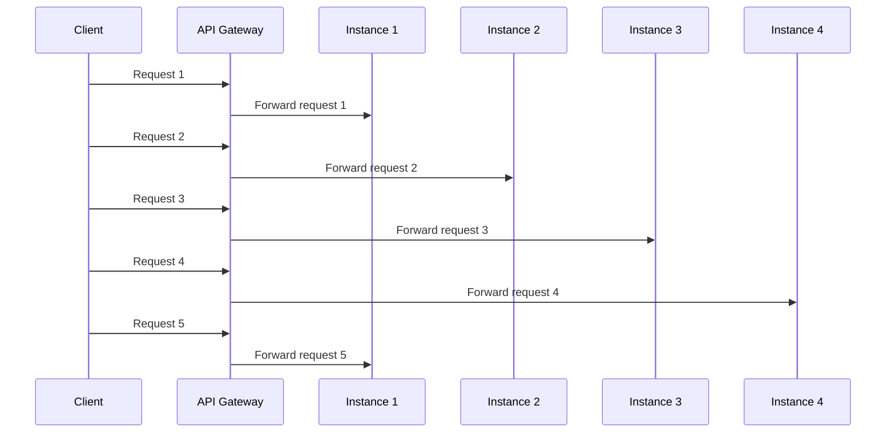

#### Cele mai puține conexiuni

Gateway-ul compară numărul de conexiuni active când sosește o cerere nouă.
Aici, instanța 2 are cele mai puține conexiuni active.

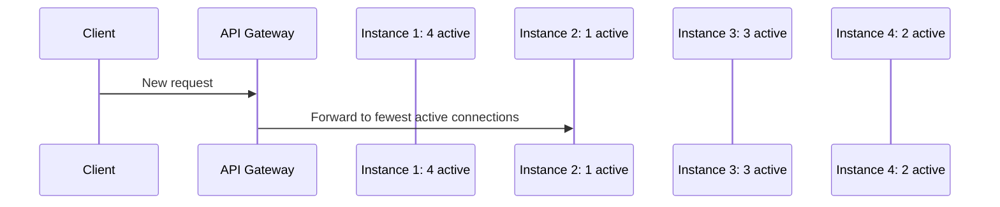

#### Hash după cheie

Gateway-ul folosește adresa IP a clientului drept cheie. În acest exemplu, două
cereri de la `198.51.100.24` ajung la instanța 1. O cerere de la
`203.0.113.8` ajunge la instanța 3. Aceste asocieri sunt exemple.

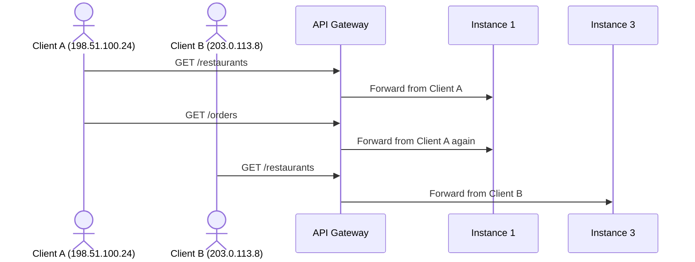

Aceasta este **afinitatea clientului**: cererile repetate de la același IP aparent
al clientului preferă aceeași instanță. Poate ajuta o sesiune dintr-un sistem vechi
în timpul trecerii la stocarea comună a sesiunilor. Nu reprezintă identitatea
Utilizatorului și nu este o regulă de corectitudine. Mai mulți Utilizatori pot
folosi același IP public, iar un proxy precum Cloudflare poate ascunde IP-ul
original față de Gateway. Asocierea se poate schimba și când o instanță se
defectează. Niciuna dintre aceste trei metode nu garantează un volum egal de muncă pentru CPU.

Rutarea prin hash este o alegere de performanță. Nu trebuie folosită pentru a
păstra o Comandă în așteptare doar în memoria unui Backend Server. O altă instanță
trebuie să poată continua după o defectare.

### Implementări folosite în producție

- **NGINX** este un proxy HTTP frecvent folosit în producție. Acceptă și trafic
  TCP/UDP prin modulul `stream`. Îl folosim în exemplele de mai jos.
- **HAProxy** acceptă [trafic TCP și HTTP prin proxy](https://www.haproxy.com/documentation/haproxy-configuration-tutorials/protocol-support/)
  cu reguli configurabile de distribuire și verificare a stării.
- **Envoy** acceptă mai multe [politici de distribuire a traficului către servere](https://www.envoyproxy.io/docs/envoy/latest/intro/arch_overview/upstream/load_balancing/load_balancers)
  și este frecvent folosit drept gateway sau proxy pentru servicii.

Acestea sunt exemple de implementări, nu un clasament. Alege în funcție de
protocolul necesar, comportamentul verificărilor de stare, modelul de operare și traficul măsurat.

### NGINX: un backend HTTP, trei metode de selecție

Acestea sunt exemple NGINX minime pentru rolul API Gateway de selecție a
backend-ului. Înlocuiește numele `.internal` cu adrese care se rezolvă către cele
patru instanțe Backend Server. Gateway-ul primește cereri HTTP pe portul `8080`.

**Round robin este metoda implicită.** Blocul `upstream` enumeră instanțele;
`proxy_pass` trimite fiecare cerere către instanța selectată.

```nginx
events {}

http {
    upstream mealdrop_backend {
        server backend1.internal:8080;
        server backend2.internal:8080;
        server backend3.internal:8080;
        server backend4.internal:8080;
    }

    server {
        listen 8080;

        location / {
            proxy_pass http://mealdrop_backend;
        }
    }
}
```

**Cele mai puține conexiuni:** Păstrează aceleași blocuri `server` și `proxy_pass`.
Înlocuiește doar blocul `upstream mealdrop_backend` cu acesta:

```nginx
upstream mealdrop_backend {
    least_conn;
    server backend1.internal:8080;
    server backend2.internal:8080;
    server backend3.internal:8080;
    server backend4.internal:8080;
}
```

**Hash după IP-ul clientului:** Înlocuiește din nou doar blocul `upstream`.
NGINX `ip_hash` încearcă să trimită cererile de la același IP aparent al clientului
către aceeași instanță cât timp aceasta rămâne disponibilă.

```nginx
upstream mealdrop_backend {
    ip_hash;
    server backend1.internal:8080;
    server backend2.internal:8080;
    server backend3.internal:8080;
    server backend4.internal:8080;
}
```

Acest exemplu presupune că NGINX vede un IP util al clientului. Dacă există un
proxy înaintea lui, NGINX poate vedea IP-ul proxy-ului pentru mulți Utilizatori.
Nu folosi afinitatea IP în locul unei stări comune durabile. Pentru IPv4, NGINX
`ip_hash` folosește primii trei octeți ai adresei, deci și IP-uri diferite pot
avea aceeași cheie hash.

Pentru o alternativă L4, NGINX folosește un bloc `stream` la nivelul superior.
Acest exemplu transmite fiecare conexiune TCP de pe portul `9000` fără să citească
calea HTTP. Modulul NGINX `stream` trebuie să fie activat în instalare.

```nginx
stream {
    upstream mealdrop_tcp {
        server backend1.internal:8080;
        server backend2.internal:8080;
        server backend3.internal:8080;
        server backend4.internal:8080;
    }

    server {
        listen 9000;
        proxy_pass mealdrop_tcp;
    }
}
```

Aceste exemple arată selecția backend-ului. O configurație de producție are nevoie
și de o politică de verificare a stării, capacitate suficientă și un plan pentru
defectarea Gateway-ului.

**Încearcă:** Mulți Clienți folosesc IP-ul public al aceluiași birou. Ce metodă le
poate concentra cererile pe o singură instanță? Ar rezolva vreo metodă saturarea
unei baze de date comune?

**Legătura cu cartea:** În _System Design Interview - An Insider's Guide_, citește
"Scale From Zero To Millions Of Users", în special
[secțiunea despre distribuitorul de trafic](https://bytebytego.com/courses/system-design-interview/scale-from-zero-to-millions-of-users#load-balancer).
Capitolul adaugă un distribuitor și un al doilea server web la arhitectura pe care
o dezvoltă. Compară acest pas cu API Gateway din MealDrop, care include selecția
backend-ului ca una dintre responsabilități.

## 2. Adaugă instanțe ale serviciului, apoi stabilește unde se păstrează starea

Această configurație adaugă patru instanțe ale aceleiași aplicații Backend Server.
API Gateway selectează acum și instanța pregătită care primește fiecare cerere.
Configurația păstrează o singură responsabilitate logică pentru baza de date din Lecția 4.

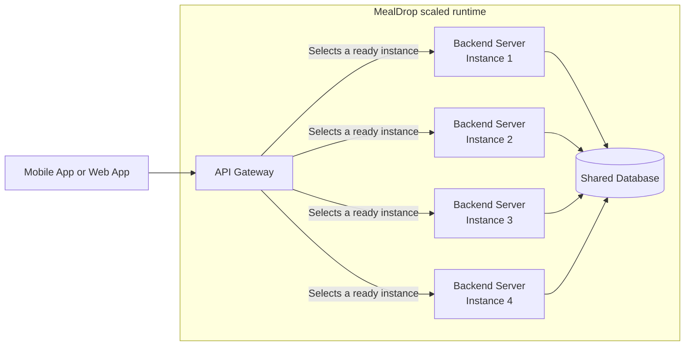

API Gateway este un container C4. Poate conține mai multe componente:

| Componentă Gateway                           | Responsabilitate                                                          |
| -------------------------------------------- | ------------------------------------------------------------------------- |
| Router de cereri                             | Trimite o cerere a produsului către componenta potrivită pentru procesare |
| Selector de backend (distribuitor de trafic) | Alege o instanță Backend Server pregătită                                 |
| Politică pentru cereri                       | Filtrează cererile nedorite și aplică limite de rată                      |

Conceptul de politică pentru cereri include un firewall pentru aplicații web
(WAF) și limitarea ratei. [Regulile personalizate Cloudflare WAF](https://developers.cloudflare.com/waf/custom-rules/)
pot bloca sau cere verificări suplimentare pentru cererile care corespund, iar
[regulile Cloudflare de limitare a ratei](https://developers.cloudflare.com/waf/rate-limiting-rules/)
pot limita traficul cererilor care corespund. Dacă Cloudflare execută aceste
reguli, acesta este un serviciu gestionat separat, la marginea rețelei, înaintea
API Gateway din MealDrop. Nu este cod din acest container. Diagrama lasă deschisă
această alegere de implementare.

**Caz de utilizare: blochează un interval de adrese sursă în timpul unui atac de refuz al serviciului (DoS).**
Să presupunem că datele despre trafic arată un val de cereri de la `203.0.113.0/24`.
Adaugă această regulă personalizată Cloudflare WAF la marginea rețelei:

```text
Expression: ip.src in {203.0.113.0/24}
Action: Block
```

Cloudflare blochează cererile care corespund înainte ca acestea să ajungă la API
Gateway. `203.0.113.0/24` este un interval rezervat pentru documentație. O regulă
reală necesită dovezi pentru intervalul selectat, deoarece blochează și
Utilizatorii legitimi de acolo. Nu oprește traficul de atac din alte intervale.
Folosește limitarea ratei sau protecție dedicată când atacul are multe surse.

Cele patru casete Backend Server sunt instanțe active ale unui singur container
C4, nu patru responsabilități noi ale produsului. Caseta bazei de date nu arată
câte noduri ale bazei de date rulează. Și disponibilitatea API Gateway necesită o proiectare.

**Procesarea cererilor fără stare locală necesară între cereri (stateless)**
înseamnă că o cerere independentă ulterioară nu are nevoie de o stare păstrată doar
într-un singur proces al serviciului. Un proces poate folosi în continuare memoria
în timp ce procesează cererea curentă.

| Stare                                       | Unde o păstrezi  | Dacă o instanță se oprește                                                      |
| ------------------------------------------- | ---------------- | ------------------------------------------------------------------------------- |
| Câmpuri extrase din cererea curentă         | În acel proces   | Încercarea în curs poate eșua; o nouă încercare poate extrage din nou câmpurile |
| Dovezi de identitate pentru cererea curentă | În acel proces   | O altă instanță validează următoarea cerere                                     |
| Schimbare confirmată a meniului             | Stocare durabilă | O altă instanță poate citi valoarea confirmată                                  |
| Comandă în așteptare și starea ei           | Stocare durabilă | O altă instanță poate continua pașii ulteriori                                  |

**Încearcă:** Ce nu ar mai funcționa dacă o Comandă în așteptare ar exista doar în
memoria instanței 2? Ce rezultat poate vedea Clientul dacă instanța 2 se oprește în
timpul unei cereri?

## 3. Stabilește numărul inițial de instanțe

Ținta de 704 RPS include deja o marjă de 10% peste o prognoză de 640 RPS. Un test
de încărcare indică 250 RPS drept capacitate sigură a unei instanțe pregătite, cu
respectarea țintei de latență. Vrem să păstrăm ținta de 704 RPS și după oprirea
unei instanțe.

```text
instanțe pentru încărcarea normală = ceil(704 / 250) = 3

cu 3 instanțe și pierderea uneia: 2 x 250 = 500 RPS  (prea puțin)
cu 4 instanțe și pierderea uneia: 3 x 250 = 750 RPS  (suficient)

minim inițial = 4 instanțe pregătite
```

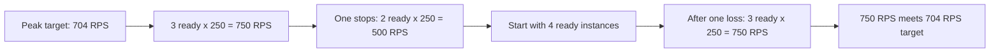

Un mecanism de scalare automată poate adăuga instanțe pe măsură ce încărcarea
observată se schimbă. Acest exemplu didactic este un fișier `mealdrop-hpa.yaml`
cu un Deployment pentru Backend Server și un Horizontal Pod Autoscaler (HPA).
Imaginea și calea `/ready` sunt valori de exemplu:

```yaml
apiVersion: apps/v1
kind: Deployment
metadata:
  name: mealdrop-backend
spec:
  replicas: 4
  selector:
    matchLabels:
      app: mealdrop-backend
  template:
    metadata:
      labels:
        app: mealdrop-backend
    spec:
      containers:
        - name: backend
          image: registry.example.com/mealdrop/backend:v1
          ports:
            - containerPort: 8080
          resources:
            requests:
              cpu: 500m
              memory: 512Mi
            limits:
              cpu: "1"
              memory: 1Gi
          readinessProbe:
            httpGet:
              path: /ready
              port: 8080
---
apiVersion: autoscaling/v2
kind: HorizontalPodAutoscaler
metadata:
  name: mealdrop-backend
spec:
  scaleTargetRef:
    apiVersion: apps/v1
    kind: Deployment
    name: mealdrop-backend
  minReplicas: 4
  maxReplicas: 10
  metrics:
    - type: Resource
      resource:
        name: cpu
        target:
          type: Utilization
          averageUtilization: 60
```

`replicas: 4` stabilește numărul inițial de instanțe din Deployment. Apoi HPA
controlează acest număr, cerând cel puțin 4 și cel mult 10 Pod-uri. Aceste numere
nu garantează că fiecare Pod este pregătit. Verificarea readiness exclude din
rutarea cererilor noi un Pod care pornește sau nu funcționează corect.

Valoarea CPU **request** de `500m` ajută Kubernetes să plaseze fiecare Pod. Este și
baza de calcul pentru utilizarea măsurată de HPA: 60% înseamnă un consum CPU mediu
de 300m pe Pod, nu 60% din limita de `1` CPU. Valoarea CPU **limit** este un plafon
în timpul execuției. Valorile request și limit pentru memorie stabilesc, la fel,
necesarul pentru plasare și un plafon.

Dacă 4 Pod-uri au un consum CPU mediu de 75% față de valorile lor request,
calculul HPA simplificat cere `ceil(4 x 75 / 60) = 5` Pod-uri. HPA are nevoie de
metrici CPU din cluster și le verifică periodic; scalarea nu este instantanee.
Pragul minim de 4 Pod-uri provine din testul de încărcare RPS, nu din ținta CPU.
Repetă acel test cu aceste setări de resurse înainte să te bazezi pe capacitatea
de 250 RPS per Pod. Un Pod nou adaugă capacitate de servire doar după ce pornește
și devine pregătit. Mai multe Pod-uri nu pot rezolva saturarea bazei de date.

**Încearcă:** Un alt serviciu are nevoie de 430 RPS după includerea marjei. Fiecare
instanță gestionează în siguranță 220 RPS. Câte instanțe pregătite păstrează ținta
după oprirea uneia? Ce măsurătoare ai repeta înainte să folosești acest număr în producție?

## 4. Definește disponibilitatea la nivelul operației Utilizatorului

Două semnale ale procesului răspund la întrebări diferite:

| Semnal    | Întrebare                                                          | Acțiune tipică                            |
| --------- | ------------------------------------------------------------------ | ----------------------------------------- |
| Readiness | Ar trebui această instanță să primească acum cereri noi?           | Adaug-o în rutare sau elimin-o din rutare |
| Liveness  | Este acest proces blocat și probabil să își revină după repornire? | Repornește-l după o verificare eșuată     |

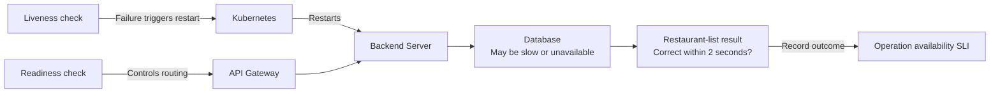

O oprire planificată poate elimina o instanță din rutare și poate da timp
cererilor active să se încheie. O oprire neașteptată poate întrerupe o cerere
activă. Următoarea cerere poate folosi o altă instanță pregătită, deoarece starea
necesară este durabilă. Nu presupune că reîncercarea unei scrieri întrerupte este
întotdeauna sigură; rezultatul ei poate fi necunoscut.

Niciun semnal nu dovedește că o operație a Utilizatorului este disponibilă.
Pentru o operație numită, măsoară un **SLI de disponibilitate la nivelul operației**:

```text
încercări valide care returnează un rezultat acceptabil în timpul țintă
--------------------------------------------------------------------
                         toate încercările valide
```

De exemplu, ținta MealDrop pentru lista de Restaurante este un rezultat corect
în cel mult 2 secunde pentru cel puțin 99.9% dintre încercările valide din
intervalul măsurat. Un Backend Server pregătit poate totuși rata această țintă
dacă baza de date comună este lentă.

Dacă Furnizorul de plăți depășește timpul de așteptare, o repornire nu îl poate
face să răspundă. MealDrop nu trebuie să afirme că plata a reușit. Dacă singura
instanță a bazei de date este indisponibilă, toate instanțele Backend Server pot
pierde aceeași operație. Marcarea tuturor instanțelor ca nepregătite sau
repornirea tuturor nu repară acea dependență comună.

## 5. Scalează baza de date prin replicare

### Începe cu o singură instanță a bazei de date

Presupune că baza de date din configurația scalată este o singură instanță activă.
Toate cele patru instanțe Backend Server îi trimit citiri și scrieri.

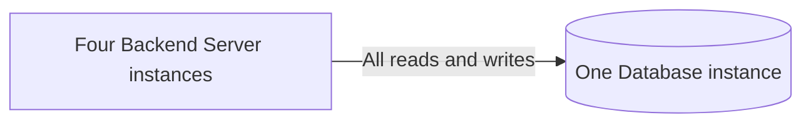

Aceasta creează două presiuni:

- Dacă acea instanță a bazei de date se oprește, replicile Backend Server continuă
  să ruleze, dar nu pot încheia operațiile care au nevoie de datele stocate.
- Dacă citirile listei de Restaurante o saturează, adăugarea de instanțe Backend
  Server nu adaugă capacitate de citire bazei de date.

Resursele suplimentare pentru instanța bazei de date pot ajuta la depășirea unei
limite de capacitate măsurate, dar o instanță rămâne un singur punct de defectare.
Copiile de rezervă sunt în continuare necesare pentru recuperarea după pierderea
datelor sau schimbări greșite, chiar dacă baza de date are replici.

**Verifică:** Ce ar vedea Clientul la citirea listei de Restaurante dacă singura
instanță a bazei de date s-ar opri și nu ar exista nicio copie cache permisă?

### Adaugă un lider de scriere și două replici de citire

O posibilă arhitectură următoare are un **lider de scriere** (numit și primary sau
master) și două **replici de citire**. Liderul acceptă scrierile și trimite
schimbările lor către ambele replici. Aceasta este o singură bază de date logică,
cu trei noduri de date active.

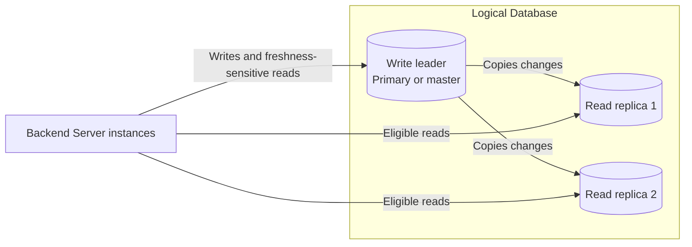

Citirile listei de Restaurante pot folosi replicile dacă produsul permite
posibila lor întârziere. O citire care trebuie să reflecte o schimbare confirmată
a unei Comenzi are nevoie de un traseu care respectă acea regulă, de exemplu
către lider. Replicile pot reduce presiunea citirilor și pot ajuta la recuperarea
după defectarea unui nod, dar nu adaugă singure capacitate de scriere. Dacă liderul
se oprește, folosirea unei replici pentru scrieri necesită o decizie separată de
preluare a rolului (failover).

### Alege cum se transmit actualizările

Arhitectura MealDrop cu un singur lider are nevoie de o copie inițială și de un
flux al schimbărilor ulterioare. Să presupunem că un Manager schimbă numele
Restaurantului `r1`:

1. O replică nouă pornește de la o copie consistentă a bazei de date, la o poziție
   cunoscută în jurnal. Nu copiază din nou fiecare Restaurant la fiecare actualizare.
2. Backend Server trimite actualizarea către lider. Într-o arhitectură bazată pe
   jurnal, liderul înregistrează tranzacția într-un jurnal ordonat și o confirmă prin commit.
3. În acest exemplu bazat pe jurnal, liderul trimite înregistrările noi către
   fiecare replică. Fiecare replică le aplică în ordine în propria copie stocată
   și face schimbarea vizibilă după ce aplică înregistrarea de commit. Replica
   urmărește până unde a aplicat jurnalul.
4. Dacă o replică se deconectează, poate continua de la ultima sa poziție cât timp
   înregistrările necesare din jurnal încă există. Altfel, are nevoie de o copie
   nouă. Până recuperează întârzierea, citirile sale pot returna vechiul nume al Restaurantului.

PostgreSQL numește jurnalul său de schimbări fizice **write-ahead log (WAL)**.
Aceasta este o implementare a fluxului, nu o regulă conform căreia fiecare bază
de date folosește WAL.

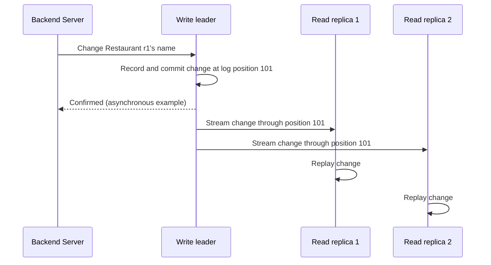

Fluxul de schimbări poate transmite forme diferite de date. _Designing
Data-Intensive Applications_ (prima ediție, capitolul 5, "Replication")
compară aceste abordări:

| Ce se transmite?                                      | Ce face o replică                                                         | Constrângerea principală                                                                                                    |
| ----------------------------------------------------- | ------------------------------------------------------------------------- | --------------------------------------------------------------------------------------------------------------------------- |
| Instrucțiuni SQL                                      | Execută din nou instrucțiunea `INSERT`, `UPDATE` sau `DELETE` a liderului | O instrucțiune care folosește timpul, valori aleatoare sau alt comportament nedeterminist poate produce un rezultat diferit |
| Înregistrări fizice din jurnal, precum PostgreSQL WAL | Aplică schimbări de stocare de nivel jos                                  | Legate strâns de motorul și versiunea bazei de date; în PostgreSQL, replica reflectă întregul cluster al bazei de date      |
| Schimbări logice ale rândurilor                       | Aplică rândurile schimbate, precum noul nume al Restaurantului `r1`       | Permit selectarea mai flexibilă a datelor, dar replica are nevoie de o schemă compatibilă                                   |
| Schimbări generate de trigger-e                       | Aplică schimbările capturate de trigger-e personalizate ale bazei de date | Flexibile, dar adaugă muncă la scriere și cod personalizat de întreținut                                                    |

Organizarea nodurilor care scriu este o alegere separată. Aceeași carte compară trei variante:

| Organizare       | Cine acceptă scrierile?                                | Principala problemă nouă                                                      |
| ---------------- | ------------------------------------------------------ | ----------------------------------------------------------------------------- |
| Un singur lider  | Un lider; replicile urmăritoare îi copiază schimbările | Replicile pot rămâne în urmă; defectarea liderului necesită preluarea rolului |
| Mai mulți lideri | Mai mult de un lider                                   | Scrierile concurente pot intra în conflict                                    |
| Fără lider       | Mai multe replici acceptă scrieri                      | Citirile pot găsi versiuni diferite care necesită reconciliere                |

Diagrama MealDrop folosește **replicarea cu un singur lider**. Arhitecturile cu
mai mulți lideri sau fără lider pot satisface alte nevoi, dar nu elimină
necesitatea de a defini rezultatul unei citiri sau scrieri.

Există și o alegere de moment: **când confirmă liderul o scriere?** Cu
**replicarea sincronă**, așteaptă confirmarea necesară de la replică. Aceasta poate
întârzia sau opri o scriere când replica nu poate fi contactată. Cu
**replicarea asincronă**, liderul poate confirma primul, iar replicile recuperează
întârzierea ulterior. Citirile din ele pot fi vechi; o schimbare confirmată se
poate și pierde dacă liderul se defectează înainte ca aceasta să ajungă la o
replică. Arhitectura trebuie să precizeze ce copii sunt necesare înainte de a
raporta succesul. În exemplul MealDrop cu două replici, așteptarea unei replici
nu o aduce și pe cealaltă la zi. Confirmarea unei replici poate însemna că a
primit, a stocat sau a aplicat o schimbare; regula aleasă influențează momentul
în care o citire de acolo o poate vedea.

**Verifică:** Liderul a confirmat noul nume al Restaurantului `r1`, dar replica 2
a aplicat jurnalul doar până la poziția 100. Ce nume poate returna o citire din
replica 2? Ar rezolva acea citire așteptarea confirmării poziției 101 de la replica 1?

### Încheie cu întrebarea despre defectarea rețelei

Acum presupune că rețeaua dintre liderul de scriere și ambele replici nu mai
transportă actualizări. Unele instanțe Backend Server pot accesa doar replicile.
Nodurile de date încă rulează, dar este posibil ca acele replici să nu cunoască o
schimbare nou acceptată a unei Comenzi. O citire a listei de Restaurante ar putea
returna un rezultat mai vechi, cu vechimea indicată, dacă produsul permite aceasta.
O citire strictă a stării Comenzii trebuie să folosească o copie care respectă
regula de actualitate sau să returneze indisponibilitate.

CAP numește această limită a datelor replicate în timpul unei partiții de rețea
(P): sistemul nu poate garanta simultan consistența liniarizabilă (C: citirile
reflectă scrierile încheiate) și un răspuns cu succes pentru fiecare operație pe
ambele părți deconectate (A). Defectarea rețelei este o condiție care trebuie
tratată. Alege rezultatul vizibil pentru fiecare operație în timpul acelei
defectări; nu atribui o etichetă CAP permanentă întregului produs. O lecție
ulterioară va defini acești termeni mai precis.

**Verifică:** În timpul acestei defectări a rețelei, ce poate arăta o citire a
listei de Restaurante? Ce poate afirma MealDrop după o scriere de plasare a
Comenzii dacă nu sosește niciodată confirmarea sincronă de la replică?

## 6. Folosește un cache doar pentru citiri repetate și sigure

Un cache păstrează o copie temporară, astfel încât citirile repetate să evite
munca suplimentară. Lista de Restaurante MealDrop pentru o zonă de livrare poate
fi citită de mulți Clienți, în timp ce datele sursă se schimbă mai rar. Aceasta o
face potrivită pentru cache. O Comandă privată sau rezultatul necunoscut al unei
plăți nu aparține acestui cache comun pentru consultarea datelor publice.

Înainte să adaugi un cache, răspunde la șase întrebări:

1. Ce muncă repetată de citire va elimina?
2. Care sunt cheia și valoarea stocată?
3. Ce sursă durabilă poate reconstrui un cache gol?
4. Cât de vechi poate fi rezultatul când este afișat ca actual sau învechit?
5. Ce vede Utilizatorul la o valoare găsită, lipsă, expirată sau la defectarea cache-ului?
6. Poate sursa durabilă gestiona traficul de rezervă când cache-ul este gol?

Acesta este un **contract didactic**, nu o regulă universală de actualitate:

| Câmp                                  | Decizie pentru lista de Restaurante                                                    |
| ------------------------------------- | -------------------------------------------------------------------------------------- |
| Cheie                                 | `restaurant-list:{delivery_area}`                                                      |
| Valoare stocată                       | Rezumate ale Restaurantelor și `cached_at`                                             |
| Sursă durabilă                        | Înregistrări confirmate ale Restaurantelor în baza de date                             |
| Interval de actualitate               | Returnează ca actual cât timp `now - cached_at <= 30 seconds`                          |
| Interval permis pentru date învechite | Returnează cu starea vizibilă `refreshing` cât timp vechimea este de cel mult 5 minute |
| Durată de viață (TTL)                 | Elimină cheia după 5 minute                                                            |
| Cheie lipsă sau expirată              | Citește baza de date; salvează în cache un rezultat reușit; returnează rezultatul      |
| Regulă de confidențialitate           | Nu stoca identitatea Clientului sau date despre Comenzi                                |

TTL controlează cât timp rămâne intrarea în cache. `cached_at` ne spune când a
fost făcută copia. Niciuna nu dovedește că sursa durabilă are cele mai recente
informații din lumea reală. Un preț de Acțiune copiat acum o secundă poate conține
în continuare un preț de la furnizor vechi de 20 de minute. Păstrează momentul
sursei când vechimea datelor sursă contează.

### Urmărește traseele de citire

| Starea cache-ului                | Acțiune                                                                     | Rezultat vizibil pentru Utilizator                           |
| -------------------------------- | --------------------------------------------------------------------------- | ------------------------------------------------------------ |
| Valoare actuală găsită           | Folosește copia                                                             | Returnează rezultatul ca actual                              |
| Cheie lipsă sau expirată         | Citește sursa durabilă și completează cache-ul dacă citirea reușește        | Returnează rezultatul sursei sau indisponibilitate explicită |
| Valoare învechită permisă găsită | Returnează copia veche și actualizeaz-o separat                             | Arată rezultatul vechi cu `refreshing` și vechimea sa        |
| Cache indisponibil               | Folosește un acces de rezervă limitat la sursă, dacă aceasta are capacitate | Returnează rezultatul sursei sau indisponibilitate explicită |

O intrare mai veche decât intervalul permis pentru date învechite nu poate fi
folosită. O actualizare eșuată în fundal nu prelungește acel interval.

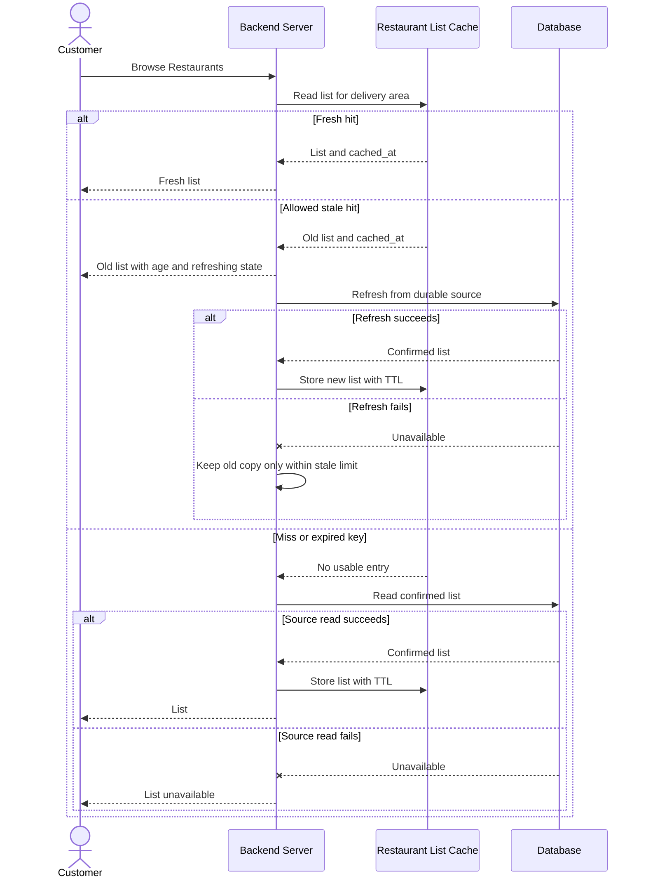

Această diagramă arată decizia privind cache-ul fără să aleagă un nivel fizic.
Aceasta este o citire **cache-aside**: când valoarea lipsește, se citește sursa și
se stochează rezultatul reușit. **Stale-while-revalidate** returnează acum un
rezultat vechi permis și îl actualizează separat. Rezultatul vechi este sigur doar
dacă regula produsului permite vechimea sa.

Dacă toate copiile cache se pierd chiar înainte de vârful din timpul mesei,
fiecare cerere ar putea deveni o citire a bazei de date. Încarcă în avans un set
măsurat și limitat de chei populare înaintea unui vârf previzibil sau după
recuperare. Limitează munca simultană de acces la sursa de rezervă. O încărcare
inițială incompletă urmează aceleași reguli pentru valori lipsă și indisponibilitate.

**Încearcă:** Cache-ul este gol, iar baza de date poate gestiona doar o parte din
traficul de vârf pentru consultarea listei. Ce rezultat ar trebui să returneze
MealDrop după epuizarea capacității sigure de rezervă? Ce măsurătoare ar arăta
dacă încărcarea în avans a ajutat?

### Adaugă niveluri de cache

Baza de date este **sursa principală de date** pentru înregistrările confirmate
ale Restaurantelor. MealDrop poate verifica două niveluri de cache înainte să
citească baza de date. Aici este arătată o instanță Backend Server; fiecare
instanță are propriul cache L1:

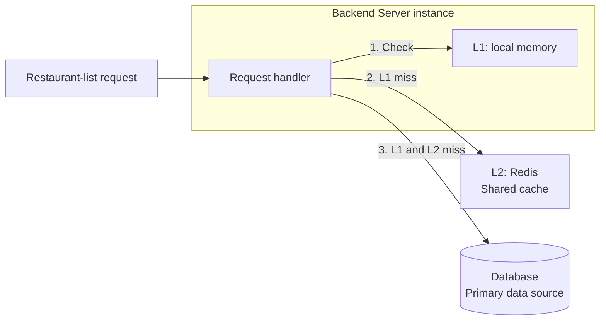

- **L1: memorie locală.** Fiecare instanță Backend Server poate păstra temporar o
  copie a listei de Restaurante în propriul proces. Aceasta evită o cerere Redis
  când valoarea este găsită local. Copia poate dispărea oricând la repornire sau
  evacuare din cache. Procesarea stateless a cererilor rămâne valabilă: nicio
  Comandă confirmată și nicio altă stare necesară nu depinde de această copie.
- **L2: Redis.** Toate instanțele Backend Server pot folosi același serviciu cache.
  Dacă valoarea lipsește din L1, verifică Redis. Dacă lipsește din Redis, citește
  baza de date. După o citire reușită din sursă, completează Redis și cache-ul L1
  al instanței care a făcut cererea.
- **Baza de date.** Stochează înregistrările confirmate și poate reconstrui ambele
  niveluri de cache. Dacă nu poate servi o citire pentru o valoare lipsă, folosește
  rezultatul de indisponibilitate din contractul de mai sus.

Păstrează `cached_at` cu fiecare copie. Aplică aceleași limite de 30 de secunde
pentru date actuale și cinci minute pentru date învechite atât unei valori găsite
în L1, cât și uneia găsite în L2. Găsirea unei valori în cache-ul local nu trebuie
să prelungească vechimea permisă a datelor. Limitează accesul de rezervă la baza de
date și munca de actualizare la nivelul tuturor instanțelor Backend Server.

**Verifică:** Instanța 1 repornește și își pierde copia L1. Ce nivel verifică
următoarea sa cerere pentru lista de Restaurante și unde poate ajunge dacă acel
nivel este gol?

## 7. Pune cache-ul listei de Restaurante în Redis

### Ce stochează Redis

Redis este un sistem de stocare a datelor în memorie, accesibil prin rețea.
Păstrează chei și valori în memorie, astfel încât o aplicație să le poată citi
rapid. Acceptă mai multe tipuri de valori, inclusiv șiruri, hash-uri, liste,
mulțimi și mulțimi sortate. În acest exemplu, un **șir** Redis păstrează întreaga
listă de Restaurante ca JSON. Redis stochează octeții; Backend Server citește
JSON-ul și verifică `cached_at`.

```text
key:   restaurant-list:central
value: {"restaurants":[{"id":"r1","name":"Noodle House"}],"cached_at":"2026-10-03T12:00:00Z"}
```

Redis poate elimina o cheie când TTL-ul ei se încheie. Cu o
[limită de memorie și o politică de evacuare](https://redis.io/docs/latest/develop/reference/eviction/)
configurate, poate elimina o cheie și mai devreme pentru a elibera spațiu.
Găsirea unei valori în Redis nu dovedește că lista este actuală; regula de vechime
din Secțiunea 6 se aplică în continuare.

### Trimite comenzi către Redis

O aplicație se conectează la Redis prin rețea și trimite comenzi. Instrumentul
`redis-cli` ne permite să trimitem manual aceleași comenzi. Aceasta este intrarea
pentru lista de Restaurante din Secțiunea 6:

```sh
redis-cli SET restaurant-list:central '{"restaurants":[{"id":"r1","name":"Noodle House"}],"cached_at":"2026-10-03T12:00:00Z"}' EX 300
redis-cli GET restaurant-list:central
redis-cli TTL restaurant-list:central
```

`SET ... EX 300` scrie șirul JSON și stabilește o expirare după 300 de secunde.
`GET` returnează șirul sau nicio valoare după expirare. `TTL` arată secundele
rămase; returnează `-2` dacă cheia nu există. Marcajul temporal este un exemplu:
când rulezi comenzile, folosește momentul în care a fost citit rezultatul din baza
de date. TTL-ul începe când se execută `SET`. Nu se reînnoiește doar pentru că se
execută `GET`.

Acesta este traseul pentru o valoare lipsă din L2, după ce valoarea nu a fost
găsită în cache-ul L1 al instanței care face cererea:

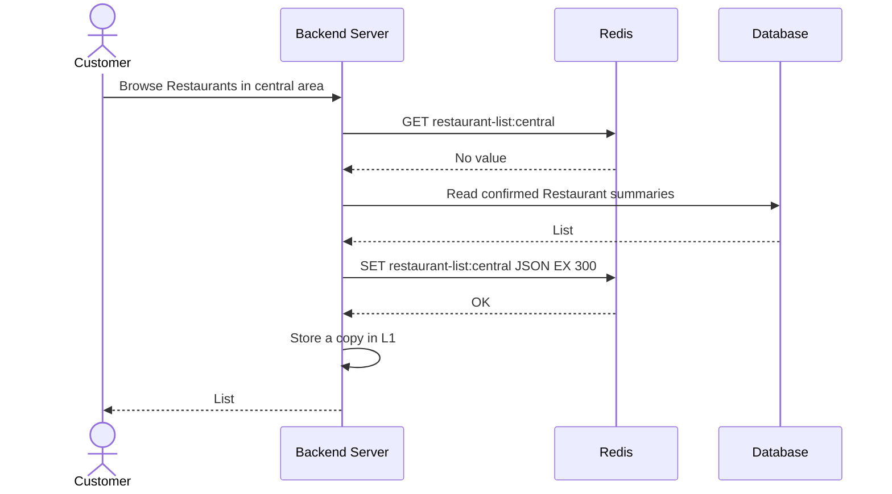

Backend Server poate folosi [clientul node-redis](https://redis.io/docs/latest/develop/clients/nodejs/)
în loc să construiască singur comenzile. Acest cod TypeScript arată aceleași
operații de citire și scriere:

```ts
import { createClient } from "redis";

const redis = createClient({
  url: process.env.REDIS_URL ?? "redis://localhost:6379",
});
redis.on("error", (error) => console.error("Redis error", error));
await redis.connect();

type RestaurantSummary = { id: string; name: string };
type CachedList = {
  restaurants: RestaurantSummary[];
  cached_at: string;
};

function cacheKey(area: string): string {
  return `restaurant-list:${area}`;
}

async function readCachedList(area: string): Promise<CachedList | null> {
  const value = await redis.get(cacheKey(area));
  return value ? (JSON.parse(value) as CachedList) : null;
}

async function storeCachedList(
  area: string,
  restaurants: RestaurantSummary[],
): Promise<void> {
  const entry: CachedList = {
    restaurants,
    cached_at: new Date().toISOString(),
  };
  await redis.set(cacheKey(area), JSON.stringify(entry), { EX: 300 });
}
```

Aceste funcții fac operațiile de intrare/ieșire cu Redis L2 în traseul de citire
din Secțiunea 6. Verifică mai întâi L1. După `readCachedList`, compară
`Date.now() - Date.parse(cached_at)` cu 30,000 ms și 300,000 ms. Dacă valoarea
lipsește, citește baza de date și apelează `storeCachedList` doar după o citire
reușită din sursă. Pentru o valoare învechită permisă, returnează lista cu
`refreshing` și vechimea sa, apoi programează o actualizare cu resurse limitate.
Dacă Redis este indisponibil, folosește doar capacitatea de rezervă a bazei de
date definită în Secțiunea 6. Baza de date rămâne sursa durabilă.

### Ce se păstrează după o repornire?

Redis servește în principal din memorie. Pentru o instanță Redis, persistența pe
disc este o alegere de configurare:

| Mod Redis        | Ce scrie pe disc                   | Ce se poate pierde la repornire                                            |
| ---------------- | ---------------------------------- | -------------------------------------------------------------------------- |
| Fără persistență | Nimic                              | Toate intrările de pe acea instanță                                        |
| Instantanee RDB  | O copie la un moment dat           | Scrierile de după ultimul instantaneu salvat                               |
| AOF              | Un jurnal al comenzilor de scriere | Scrierile recente, în funcție de momentul sincronizării jurnalului pe disc |

Redis poate combina și RDB cu AOF. Replicarea oferă o altă copie activă, dar o
replică nu este o copie de rezervă și nu elimină toate intervalele în care se pot
pierde date. Pentru acest cache al listei de Restaurante, un Redis gol este
acceptabil doar fiindcă baza de date poate reconstrui intrările, iar traficul de
rezervă este limitat. Activarea persistenței Redis poate ajuta la restaurarea unui
cache deja populat, dar nu schimbă regula de actualitate a listei de Restaurante.

### Compară câteva alternative

| Sistem de stocare                                         | Model de date și client                                                         | Recuperare de pe disc                                                                                                                                                         | Utilizare principală sau compromis                                                                               |
| --------------------------------------------------------- | ------------------------------------------------------------------------------- | ----------------------------------------------------------------------------------------------------------------------------------------------------------------------------- | ---------------------------------------------------------------------------------------------------------------- |
| [Redis](https://redis.io/docs/latest/develop/data-types/) | Mai multe tipuri de date; comenzi Redis                                         | Instantanee RDB și AOF opționale                                                                                                                                              | Operații cache flexibile; planifică pierderea cache-ului și limitele de memorie                                  |
| [Memcached](https://docs.memcached.org/)                  | Cache simplu cheie/valoare în memorie; protocol Memcached                       | [Repornirea cu recuperarea cache-ului](https://docs.memcached.org/features/restart/) poate recupera un cache după o oprire controlată; nu este stocare durabilă de uz general | Potrivit pentru valori simple care pot fi pierdute; mai puține operații pe date                                  |
| [Valkey](https://valkey.io/topics/introduction/)          | Tipuri de date în memorie și comenzi în stil Redis                              | Instantanee RDB și AOF opționale                                                                                                                                              | Model similar cu Redis; verifică compatibilitatea comenzilor și a clienților pentru versiunile alese             |
| [Dragonfly](https://www.dragonflydb.io/docs)              | API-uri compatibile cu Redis și Memcached; server cu mai multe fire de execuție | Instantanee opționale pe disc                                                                                                                                                 | Poate servi volume de lucru cache similare; verifică compatibilitatea funcționalităților și cerințele de operare |

Regula produsului vine prima: fiecare opțiune are nevoie de un traseu de citire
din sursă, o limită de actualitate și un răspuns când cache-ul este indisponibil.

**Încearcă:** Redis repornește chiar înainte de traficul de la cină și nu are
persistență. Ce chei lipsesc? Ce împiedică toate cererile de consultare să
suprasolicite baza de date? Ar face AOF ca o listă veche de Restaurante să devină actuală?

## 8. Aplică metoda în Laboratorul 4

[Laboratorul 4: Scalează traseul de citire al Dashboard-ului](../labs/04-read-heavy-request-path/README.md)
folosește Personal Investment Dashboard. Folosește încărcarea și capacitatea date
pentru a stabili numărul de instanțe ale serviciului și de replici de citire.
Apoi decide:

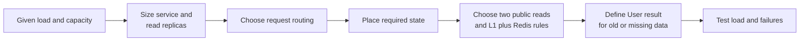

- cum selectează Gateway-ul sau routerul de cereri o instanță Dashboard pregătită;
- cum ajung datele de piață acceptate la liderul de scriere și la replicile de citire;
- dacă un TTL simplu sau stale-while-revalidate se potrivește fiecărui caz de utilizare a cache-ului;
- cum servesc L1 și Redis două citiri publice și cum completează comenzile Redis o cheie;
- ce vede Utilizatorul pentru un preț vechi de la furnizor, o defectare a cache-ului sau o defectare a stocării;
- ce set limitat de chei trebuie încărcat în avans înainte de deschiderea pieței;
- ce teste de încărcare și defectare ar susține arhitectura.

Nu considera un răspuns rapid din cache drept dovadă că prețul Acțiunii este recent.

## Referințe: citește pornind de la o întrebare

Folosește întrebarea pentru a alege de unde să începi lectura:

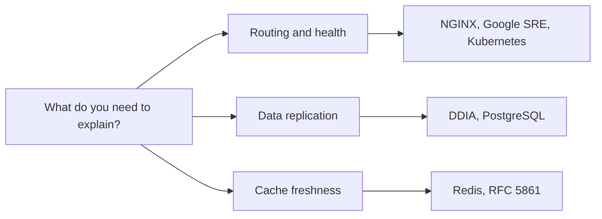

### Lectură de bază

1. [NGINX: Distribuirea traficului HTTP](https://nginx.org/en/docs/http/load_balancing.html).
   Compară exemplele pentru metoda implicită și metoda cu cele mai puține
   conexiuni. Apoi verifică
   [directiva `ip_hash`](https://nginx.org/en/docs/http/ngx_http_upstream_module.html#ip_hash)
   și [modulul TCP `stream`](https://nginx.org/en/docs/stream/ngx_stream_core_module.html).
   **Întrebare:** Ce parte din fiecare configurație alege un backend și ce parte primește traficul?
2. [Google SRE: Distribuirea traficului în centrul de date](https://sre.google/sre-book/load-balancing-datacenter/).
   Citește "Identifying Bad Tasks" și "Load Balancing Policies".
   **Întrebare:** De ce o instanță care pare sănătoasă poate fi totuși o alegere slabă pentru rutare?
3. [Kubernetes: Verificări liveness, readiness și startup](https://kubernetes.io/docs/concepts/workloads/pods/probes/).
   Citește definițiile readiness și liveness și avertizarea despre verificările
   liveness eșuate. **Întrebare:** Ce semnal elimină o instanță din traficul nou și ce semnal o repornește?
4. [Martin Kleppmann: _Designing Data-Intensive Applications_](https://dataintensive.net/),
   prima ediție, capitolul 5, "Replication". Citește "Setting Up New Followers",
   "Implementation of Replication Logs" și "Problems with Replication Lag".
   Apoi compară "Multi-Leader Replication" și "Leaderless Replication".
   **Întrebare:** De ce o replică urmăritoare nouă are nevoie de o copie și de o
   poziție în jurnal și când poate o citire să returneze date vechi?
5. [Redis: Cache-Aside](https://redis.io/docs/latest/develop/use-cases/cache-aside/).
   Urmărește traseul de la valoare lipsă la citirea sursei și completarea
   cache-ului. **Întrebare:** De ce trebuie să fie sigură golirea cache-ului?
6. [Redis: Comanda SET](https://redis.io/docs/latest/commands/set/) și
   [clientul Node.js](https://redis.io/docs/latest/develop/clients/nodejs/).
   Citește despre opțiunea `EX` și exemplele `set`/`get`. **Întrebare:** Ce comandă
   limitează timpul cât cheia listei de Restaurante rămâne în Redis și ce câmp îi
   spune sistemului MealDrop vechimea ei?

### Aprofundează

- [Kubernetes: Scalarea orizontală automată a Pod-urilor](https://kubernetes.io/docs/tasks/run-application/horizontal-pod-autoscale/).
  Citește formula de bază a buclei de control, baza de calcul a utilizării CPU și
  limitele numărului de replici. **Întrebare:** De ce o valoare CPU request de
  `500m` face ca un consum CPU de 300m să fie egal cu ținta de 60% și de ce
  adăugarea unui Pod nu adaugă imediat capacitate?
- [Kubernetes: Gestionarea resurselor pentru Pod-uri și containere](https://kubernetes.io/docs/concepts/configuration/manage-resources-containers/).
  Citește "Requests and limits". **Întrebare:** Ce valoare ajută la plasarea unui
  Pod și ce valoare îi poate limita consumul CPU?
- [Google SRE: Gestionarea defectărilor în cascadă](https://sre.google/sre-book/addressing-cascading-failures/).
  Citește "Handling Overload". **Întrebare:** Cum poate defectarea cache-ului să
  suprasolicite sursa durabilă?
- [PostgreSQL: Servere standby cu transfer de jurnal](https://www.postgresql.org/docs/current/warm-standby.html).
  Citește "Streaming Replication" și "Synchronous Replication". **Întrebare:** Ce
  jurnal aplică un server standby și ce poate aștepta un commit?
- [PostgreSQL: Replicarea logică](https://www.postgresql.org/docs/current/logical-replication.html).
  Citește prezentarea generală și [arhitectura](https://www.postgresql.org/docs/current/logical-replication-architecture.html).
  **Întrebare:** Cum diferă un flux de schimbări ale rândurilor de aplicarea fizică a WAL?
- [Martin Kleppmann: Nu mai numiți bazele de date CP sau AP](https://martin.kleppmann.com/2015/05/11/please-stop-calling-databases-cp-or-ap.html).
  Citește "CAP-Availability" după Secțiunea 5. **Întrebare:** De ce o singură
  etichetă CAP nu spune ce returnează o citire a stării Comenzii în timpul unei partiții?
- [RFC 5861: Stale-While-Revalidate](https://www.rfc-editor.org/rfc/rfc5861.html).
  Citește Secțiunea 3 pentru mecanismul HTTP original. **Întrebare:** Ce regulă a
  produsului trebuie să definească MealDrop înainte să servească o valoare veche
  din cache-ul aplicației?
- [Redis: Persistența](https://redis.io/docs/latest/operate/oss_and_stack/management/persistence/).
  Compară RDB, AOF și lipsa persistenței. **Întrebare:** Ce poate pierde fiecare mod
  după o repornire bruscă?
