# Lecture 5: Horizontal Scaling, Caching, and Availability

Lecture 4 gave MealDrop one Backend Server and one Database. Lecture 3 gave us
measured pressure: one Backend Server instance can safely handle 250 requests
per second (RPS), but the peak target is 704 RPS. One instance can also stop.

This guide follows one decision path:

```text
measured load or failure
  -> choose a scaling mechanism
  -> place required state
  -> define the User-visible result
  -> test the full request path
```

By the end, you should be able to size service instances, explain when
database replicas help and when they can lag, and define a safe cache for
repeated reads.
The numbers in this guide are teaching assumptions, not production facts.

## 1. Choose the pressure before the mechanism

**Scalability** means keeping selected quality targets as workload changes.
It does not mean that every request is fast at every load.

| Pressure | Possible first move | Limit to check |
| --- | --- | --- |
| One instance lacks CPU or memory | Give it more resources: vertical scaling | One process can still fail; a larger unit has a ceiling |
| One instance cannot meet the target load | Add equivalent instances: horizontal scaling | Shared dependencies may become the bottleneck |
| One process failure removes all request handling | Keep another ready instance | It needs access to required state |
| Database reads are saturated | Measure, tune, or add suitable read copies | Data copies must receive updates and can lag |

A load balancer directs traffic to a service instance. Its health policy
should avoid instances that cannot serve. It does not create processing
capacity. Four service instances also do not create four copies of durable
MealDrop data.

There are two different uses of **replica**:

- A **service replica** runs the same application. Requests can go to any
  instance if required state for a later request does not live only in one
  process.
- A **data replica** holds a copy of stored data. It can serve suitable reads
  or help after a data-node failure, but it must receive accepted updates.
  Replication does not automatically increase write capacity.

A Database can also get more resources without adding data replicas. Measure
which resource or operation is limiting it before choosing a change.

**Check:** Four Backend Server instances are idle, but every browse request
waits for one saturated Database. Which part should you measure next?

### What can a load balancer inspect?

| Layer | What it can use | MealDrop example | Limit |
| --- | --- | --- | --- |
| Layer 4 (L4) | Transport details, such as addresses and ports | Send a TCP connection to one Backend Server instance | It cannot route by the HTTP path; several requests can share one connection |
| Layer 7 (L7) | HTTP request details, such as host, path, and headers | Route `/restaurants` and `/orders` differently | It must read the HTTP message; for HTTPS, this usually means terminating TLS |

L4 can pass encrypted traffic through to a backend. L7 can make a choice for
each HTTP request. The **layer** says what the balancer can inspect. The
**selection method** says how it chooses among suitable instances. Do not
confuse the two.

The API Gateway and load balancer are roles that one proxy can combine.
MealDrop combines them in its API Gateway container: the Gateway routes
product requests and selects a Backend Server instance.

### How does it choose an instance?

| Method | Rule | Useful when | Main limit |
| --- | --- | --- | --- |
| Round robin | Take turns across instances | Requests have similar cost | Equal request counts can still mean unequal work |
| Load based, such as least connections | Prefer the instance with the fewest active connections | Some requests hold connections longer | Connection count is only a proxy for CPU or other load |
| Hash based | Map the same key to the same instance | Keep a client's repeated requests on one instance when affinity is needed | Shared IPs can concentrate Users; IP changes or instance failures can change the mapping |

#### Round robin

Each new request goes to the next instance. With four equal instances, the
fifth request returns to instance 1.

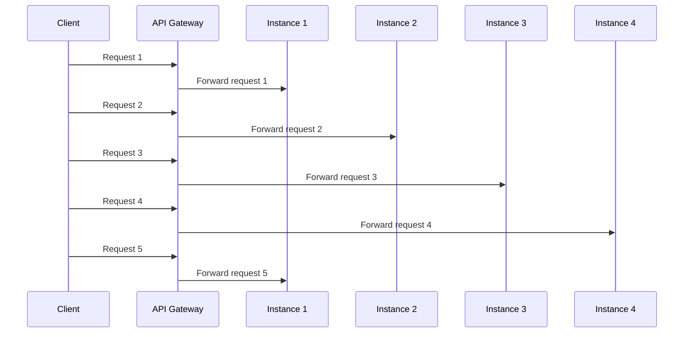

#### Least connections

The Gateway compares active connection counts when a new request arrives.
Here, instance 2 has the fewest active connections.

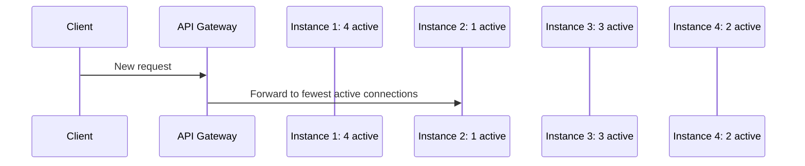

#### Hash by key

The Gateway uses the client IP address as the key. In this example, two
requests from `198.51.100.24` reach instance 1. A request from
`203.0.113.8` reaches instance 3. These are example mappings.

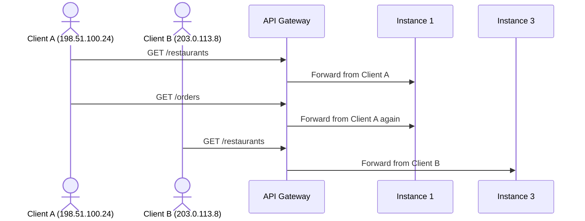

This is **client affinity**: repeated requests from one apparent client IP
prefer the same instance. It can help a legacy session during a move to
shared session storage. It is not a User identity or a correctness rule.
Several Users can share one public IP, and a proxy such as Cloudflare can
hide the original IP from the Gateway. The mapping can also change when an
instance fails. None of these three methods guarantees equal CPU work.

Hash routing is a performance choice. It must not be used to keep a pending
Order only in one Backend Server's memory. Another instance must still be
able to continue after a failure.

### Production implementations

- **NGINX** is a common production HTTP proxy. It also supports TCP/UDP
  proxying through its `stream` module. We use it for the examples below.
- **HAProxy** supports [TCP and HTTP proxying](https://www.haproxy.com/documentation/haproxy-configuration-tutorials/protocol-support/)
  with configurable balancing and health rules.
- **Envoy** supports several [upstream load balancing policies](https://www.envoyproxy.io/docs/envoy/latest/intro/arch_overview/upstream/load_balancing/load_balancers)
  and is often used as a gateway or service proxy.

These are examples of implementations, not a ranking. Choose by the required
protocol, health behavior, operations model, and measured traffic.

### NGINX: one HTTP backend, three selection methods

These are minimal NGINX examples for the API Gateway's backend-selection
role. Replace the `.internal` names with addresses that resolve to the four
Backend Server instances. The Gateway receives HTTP requests on port `8080`.

**Round robin is the default.** The `upstream` block lists the instances;
`proxy_pass` sends each request to the selected instance.

```nginx
events {}

http {
    upstream mealdrop_backend {
        server backend1.internal:8080;
        server backend2.internal:8080;
        server backend3.internal:8080;
        server backend4.internal:8080;
    }

    server {
        listen 8080;

        location / {
            proxy_pass http://mealdrop_backend;
        }
    }
}
```

**Least connections:** Keep the same `server` and `proxy_pass` blocks. Replace
only the `upstream mealdrop_backend` block with this one:

```nginx
upstream mealdrop_backend {
    least_conn;
    server backend1.internal:8080;
    server backend2.internal:8080;
    server backend3.internal:8080;
    server backend4.internal:8080;
}
```

**Hash by client IP:** Again replace only the `upstream` block. NGINX
`ip_hash` tries to send requests from the same apparent client IP to the
same instance while it remains available.

```nginx
upstream mealdrop_backend {
    ip_hash;
    server backend1.internal:8080;
    server backend2.internal:8080;
    server backend3.internal:8080;
    server backend4.internal:8080;
}
```

This example assumes NGINX sees a useful client IP. If a proxy sits before
it, NGINX may see the proxy's IP for many Users. Do not use IP affinity as a
substitute for durable shared state. For IPv4, NGINX `ip_hash` uses the first
three address octets, so different IPs can also share a hash key.

For an L4 alternative, NGINX uses a top-level `stream` block. This example
forwards each TCP connection on port `9000` without reading its HTTP path.
The NGINX `stream` module must be enabled in the installation.

```nginx
stream {
    upstream mealdrop_tcp {
        server backend1.internal:8080;
        server backend2.internal:8080;
        server backend3.internal:8080;
        server backend4.internal:8080;
    }

    server {
        listen 9000;
        proxy_pass mealdrop_tcp;
    }
}
```

These examples show backend selection. A production setup also needs a health
policy, enough capacity, and a plan for the Gateway's own failure.

**Try it:** Many Customers share one office's public IP. Which method could
concentrate their requests on one instance? Would any method fix a saturated
shared Database?

**Book connection:** In *System Design Interview - An Insider's Guide*, read
"Scale From Zero To Millions Of Users," especially the
["Load balancer" section](https://bytebytego.com/courses/system-design-interview/scale-from-zero-to-millions-of-users#load-balancer).
The chapter adds a balancer and a second web server to its evolving design.
Compare that step with MealDrop's API Gateway, which includes backend
selection as one responsibility.

## 2. Add service instances, then place state

This runtime adds four instances of the same Backend Server application. The
API Gateway now also selects which ready instance receives each request. It
keeps one logical Database responsibility from Lecture 4.

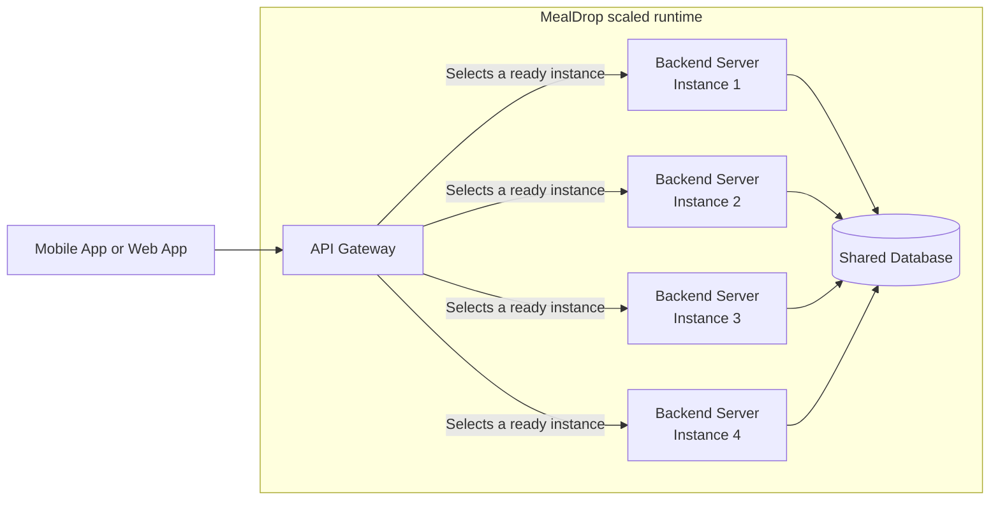

The API Gateway is one C4 container. It can contain several components:

| Gateway component | Responsibility |
| --- | --- |
| Request router | Send a product request to the right handler |
| Backend selector (load balancer) | Choose a ready Backend Server instance |
| Request policy | Filter unwanted requests and apply rate limits |

The request-policy concept includes a web application firewall (WAF) and
rate limiting. [Cloudflare WAF custom rules](https://developers.cloudflare.com/waf/custom-rules/)
can block or challenge matching requests, and
[Cloudflare rate limiting rules](https://developers.cloudflare.com/waf/rate-limiting-rules/)
can limit matching request traffic. If Cloudflare runs these rules, it is a
separate managed edge service before MealDrop's API Gateway. It is not code
inside this container. This diagram leaves that deployment choice open.

**Use case: block a source range during a denial-of-service (DoS) attack.**
Suppose traffic data shows a request flood from `203.0.113.0/24`. Add this
Cloudflare WAF custom rule at the edge:

```text
Expression: ip.src in {203.0.113.0/24}
Action: Block
```

Cloudflare blocks matching requests before they reach the API Gateway.
`203.0.113.0/24` is a documentation-only range. A real rule needs evidence
for the selected range because it also blocks legitimate Users there. It
does not stop attack traffic from other ranges. Use rate limiting or dedicated
protection when the attack has many sources.

The four Backend Server boxes are running instances of one C4 container, not
four new product responsibilities. The Database box does not state how many
database nodes run. The API Gateway's own availability also needs a design.

**Stateless request handling** means that a later independent request does not
need state held only in one service process. A process can still use memory
while it handles its current request.

| State | Place it | If one instance stops |
| --- | --- | --- |
| Parsed fields for the current request | In that process | The in-flight attempt can fail; a new attempt can parse again |
| Identity evidence for the current request | In that process | Another instance validates the next request |
| Confirmed menu change | Durable store | Another instance can read the confirmed value |
| Pending Order and its status | Durable store | Another instance can continue the later steps |

**Try it:** What would break if a pending Order lived only in instance 2's
memory? What result can the Customer see if instance 2 stops during a request?

## 3. Size the starting set of instances

The 704 RPS target already includes a 10% buffer over a 640 RPS forecast. A
load test gives 250 RPS as the safe capacity of one ready instance while its
latency target is met. We also want to preserve the 704 RPS target after one
instance stops.

```text
instances for normal load = ceil(704 / 250) = 3

with 3 instances and one loss: 2 x 250 = 500 RPS  (too little)
with 4 instances and one loss: 3 x 250 = 750 RPS  (enough)

starting minimum = 4 ready instances
```

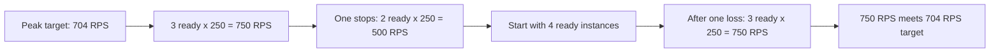

An autoscaler can add instances as observed load changes. This teaching
example is one `mealdrop-hpa.yaml` file with a Backend Server Deployment and
its Horizontal Pod Autoscaler (HPA). The image and `/ready` path are example
values:

```yaml
apiVersion: apps/v1
kind: Deployment
metadata:
  name: mealdrop-backend
spec:
  replicas: 4
  selector:
    matchLabels:
      app: mealdrop-backend
  template:
    metadata:
      labels:
        app: mealdrop-backend
    spec:
      containers:
        - name: backend
          image: registry.example.com/mealdrop/backend:v1
          ports:
            - containerPort: 8080
          resources:
            requests:
              cpu: 500m
              memory: 512Mi
            limits:
              cpu: "1"
              memory: 1Gi
          readinessProbe:
            httpGet:
              path: /ready
              port: 8080
---
apiVersion: autoscaling/v2
kind: HorizontalPodAutoscaler
metadata:
  name: mealdrop-backend
spec:
  scaleTargetRef:
    apiVersion: apps/v1
    kind: Deployment
    name: mealdrop-backend
  minReplicas: 4
  maxReplicas: 10
  metrics:
    - type: Resource
      resource:
        name: cpu
        target:
          type: Utilization
          averageUtilization: 60
```

`replicas: 4` sets the initial Deployment count. The HPA then controls that
count, asking for at least 4 and at most 10 Pods. These counts do not
guarantee that every Pod is ready. The readiness check keeps a starting or
unhealthy Pod out of new request routing.

The CPU **request** of `500m` helps Kubernetes place each Pod. It is also
the HPA's utilization baseline: 60% means 300m average CPU use per Pod, not
60% of the `1` CPU limit. The CPU **limit** is a runtime ceiling. The memory
request and limit likewise set placement needs and a ceiling.

If 4 Pods average 75% CPU use relative to their requests, the simplified
HPA calculation asks for `ceil(4 x 75 / 60) = 5` Pods. The HPA needs CPU
metrics from the cluster and checks them periodically; scaling is not
instant. The 4-Pod floor comes from the RPS load test, not the CPU target.
Repeat that load test with these resource settings before trusting the
250 RPS per-Pod capacity. A new Pod adds serving capacity only after it
starts and becomes ready. More Pods cannot repair a saturated Database.

**Try it:** A different service needs 430 RPS after its buffer. Each instance
safely handles 220 RPS. How many ready instances preserve the target after
one stops? Which measurement would you repeat before using this count in
production?

## 4. Define availability at the User operation

Two process signals answer different questions:

| Signal | Question | Typical action |
| --- | --- | --- |
| Readiness | Should this instance receive new requests now? | Add it to or remove it from routing |
| Liveness | Is this process stuck and likely to recover after restart? | Restart it after a failed check |

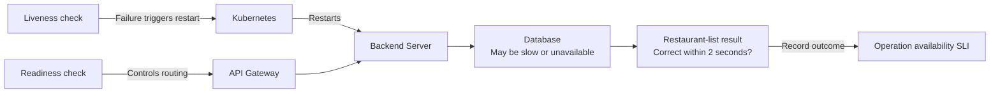

A planned stop can remove an instance from routing and give its active
requests time to finish. A crash can interrupt an active request. The next
request can use another ready instance because required state is durable.
Do not assume that retrying an interrupted write is always safe; its result
may be unknown.

Neither signal proves that a User operation is available. For a named
operation, measure an **operation-level availability SLI**:

```text
valid attempts that return an acceptable result within the target
--------------------------------------------------------------------
                         all valid attempts
```

For example, MealDrop's Restaurant-list target is a correct result within 2
seconds for at least 99.9% of valid attempts in the measured window. A ready
Backend Server can still miss this target if the shared Database is slow.

If the Payment Provider times out, a restart cannot make the provider answer.
MealDrop must not claim that payment succeeded. If its only Database instance
is unavailable, all Backend Server instances may lose the same operation.
Marking every instance unready or restarting all of them does not repair that
shared dependency.

## 5. Scale the Database with Replication

### Start with one Database instance

Assume that the Database box in the scaled runtime is one running instance.
All four Backend Server instances send reads and writes to it.

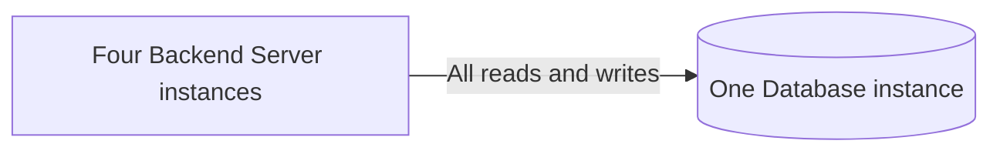

This creates two pressures:

- If that Database instance stops, the Backend Server replicas still run but
  cannot complete operations that need the stored data.
- If Restaurant-list reads saturate it, adding more Backend Server instances
  does not add Database read capacity.

Giving the Database instance more resources can help a measured capacity
limit, but one instance remains one failure point. Backups are still needed
to recover from data loss or bad changes, even if the Database has replicas.

**Check:** What would the Customer see during a Restaurant-list read if the
only Database instance stopped and no allowed cache copy existed?

### Add one write leader and two read replicas

One possible next design has a **write leader** (also called a primary or
master) and two **read replicas**. The leader accepts writes and sends their
changes to both replicas. This is one logical Database with three running
data nodes.

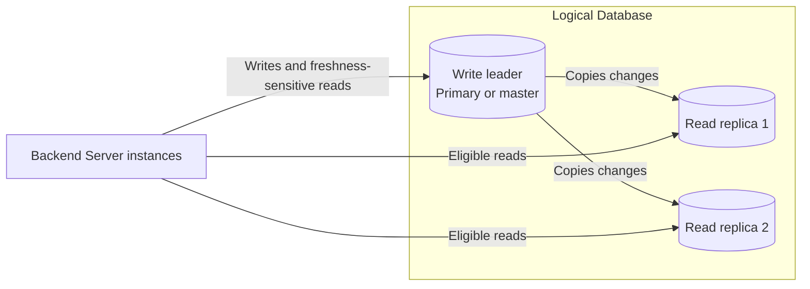

Restaurant-list reads can use the replicas if the product permits their
possible lag. A read that must reflect a confirmed Order change needs a
route that meets that rule, such as the leader. Replicas can reduce read
pressure and can support recovery from a node failure, but they do not add
write capacity by themselves. If the leader stops, using a replica for
writes requires a separate failover decision.

### Choose how updates move

MealDrop's one-leader design needs an initial copy and a stream of later
changes. Suppose a Manager changes Restaurant `r1`'s name:

1. A new replica starts from a consistent copy of the Database at a known
   log position. It does not copy every Restaurant again for each update.
2. The Backend Server sends the update to the leader. In a log-based design,
   the leader records the transaction in an ordered log and commits it.
3. In this log-based example, the leader sends new records to each replica.
   Each replica replays them in order into its own stored copy and makes the
   change visible after it replays the commit. It tracks how far it has
   applied the log.
4. If a replica disconnects, it can resume from its last position while the
   needed log records still exist. Otherwise, it needs a new copy. Until it
   catches up, its reads can return the old Restaurant name.

PostgreSQL calls its physical change log the **write-ahead log (WAL)**. This
is one implementation of the flow, not a rule that every Database uses WAL.

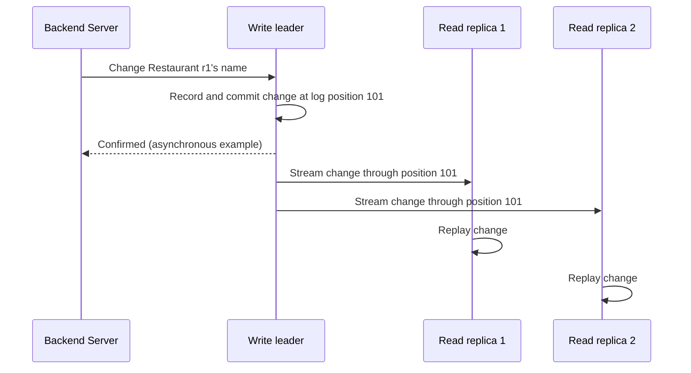

The change stream can carry different forms of data. *Designing
Data-Intensive Applications* (first edition, Chapter 5, "Replication")
compares these approaches:

| What moves? | What a replica does | Main constraint |
| --- | --- | --- |
| SQL statements | Runs the leader's `INSERT`, `UPDATE`, or `DELETE` again | A statement with time, random values, or other non-deterministic behavior can produce a different result |
| Physical log records, such as PostgreSQL WAL | Replays low-level storage changes | Closely tied to the Database engine and version; the replica mirrors the whole database cluster in PostgreSQL |
| Logical row changes | Applies changed rows, such as Restaurant `r1`'s new name | Can select data more flexibly, but the replica needs a compatible schema |
| Trigger-generated changes | Applies changes captured by custom Database triggers | Flexible, but adds write work and custom code to maintain |

The writer arrangement is a separate choice. The same book compares three:

| Arrangement | Who accepts writes? | Main new problem |
| --- | --- | --- |
| Single-leader | One leader; followers copy its changes | Followers can lag; leader failure needs failover |
| Multi-leader | More than one leader | Concurrent writes can conflict |
| Leaderless | Several replicas accept writes | Reads can find different versions and need reconciliation |

MealDrop's diagram uses **single-leader replication**. Multi-leader and
leaderless designs can fit other needs, but they do not remove the need to
define the result of a read or write.

There is also a timing choice: **when does the leader confirm a write?** With
**synchronous replication**, it waits for the required replica confirmation.
This can delay or stop a write when that replica cannot be reached. With
**asynchronous replication**, the leader can confirm first and the replicas
catch up later. Reads from them can be old; an acknowledged change can also
be lost if the leader fails before it reaches a replica. The design must
state which copies are required before it claims success. In MealDrop's
two-replica example, waiting for one replica does not make the other current.
A replica's confirmation can mean it received, stored, or replayed a change;
the chosen rule affects when a read there can see it.

**Check:** The leader has confirmed Restaurant `r1`'s new name, but replica 2
has replayed only through log position 100. What name can a read from replica
2 return? Would waiting for replica 1 to confirm position 101 fix that read?

### End with the network-fault question

Now suppose the network between the write leader and both replicas stops
carrying updates. Some Backend Server instances can reach only the replicas.
The data nodes still run, but those replicas may not know about a newly
accepted Order change. A Restaurant-list read might return an age-labeled
older result if the product permits it. A strict Order-status read must use
a copy that meets its freshness rule or return unavailable.

CAP names this limit for replicated data during a network partition (P):
the system cannot guarantee both linearizable consistency (C: reads reflect
completed writes) and a
successful answer for every operation on both disconnected sides (A). The
network fault is a condition to handle. Choose the visible result for each
operation during that fault; do not assign one permanent CAP label to the
whole product. A later lecture will define these terms more precisely.

**Check:** During this network fault, what may a Restaurant-list read show?
What may MealDrop claim after a Place Order write if synchronous replica
confirmation never arrives?

## 6. Use a cache only for repeated, safe reads

A cache holds a temporary copy so repeated reads can avoid work. MealDrop's
Restaurant list for one delivery area may be read by many Customers while its
underlying data changes less often. That makes it a cache candidate. A private
Order or an unknown payment outcome does not belong in this shared public
browse cache.

Before adding a cache, answer six questions:

1. Which repeated read work will it remove?
2. What is the key and stored value?
3. Which durable source can rebuild an empty cache?
4. How old may the result be when it is shown as fresh or stale?
5. What does the User see on a hit, miss, expired entry, or cache failure?
6. Can the durable source handle fallback traffic when the cache is empty?

Here is one **teaching contract**, not a universal freshness rule:

| Field | Restaurant-list decision |
| --- | --- |
| Key | `restaurant-list:{delivery_area}` |
| Stored value | Restaurant summaries and `cached_at` |
| Durable source | Confirmed Restaurant records in the Database |
| Fresh window | Return as fresh while `now - cached_at <= 30 seconds` |
| Allowed stale window | Return with a visible `refreshing` state while age is at most 5 minutes |
| Time to live (TTL) | Remove the key after 5 minutes |
| Miss or expired key | Read the Database; cache a successful result; return the result |
| Privacy rule | Store no Customer identity or Order data |

TTL controls how long the entry remains in the cache. `cached_at` tells us
when this copy was made. Neither proves that the durable source itself has
the latest real-world information. A Stock price copied one second ago can
still contain a provider price from 20 minutes ago. Keep the source's time
when source-data age matters.

### Trace the read paths

| Cache state | Action | User-visible result |
| --- | --- | --- |
| Fresh hit | Use the copy | Return the result as fresh |
| Miss or expired key | Read the durable source and fill the cache if the read succeeds | Return the source result or explicit unavailability |
| Allowed stale hit | Return the old copy and refresh it separately | Show the old result with `refreshing` and its age |
| Cache unavailable | Use a bounded source fallback if it has capacity | Return the source result or explicit unavailability |

An entry older than the allowed stale window is unusable. A failed background
refresh does not extend that window.

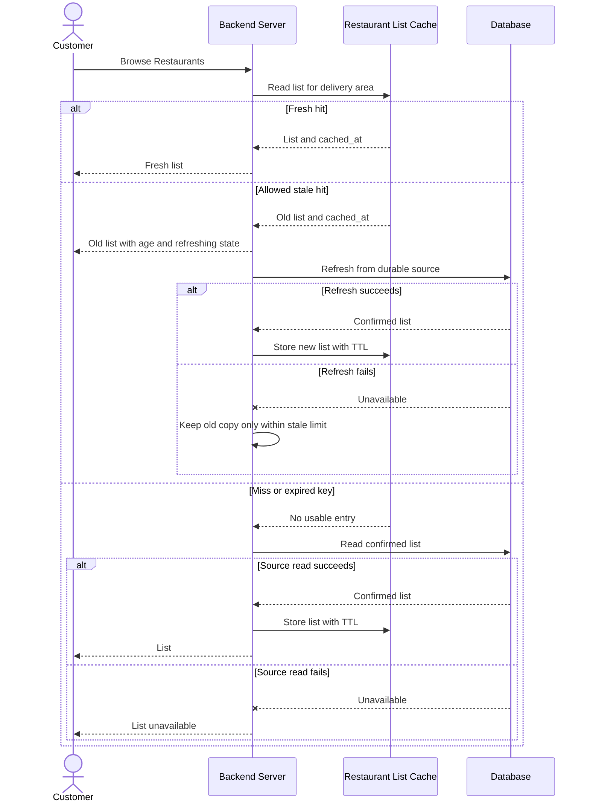

This diagram shows the cache decision without choosing a physical layer.
This is a **cache-aside** read: a miss reads the source and stores the
successful result. **Stale-while-revalidate** returns an allowed old result
now and refreshes it separately. The old result is safe only if the product
rule permits its age.

If all cache copies are lost just before the meal-time peak, every request
could become a Database read. Pre-warm a measured, bounded set of popular keys
before a predictable burst or after recovery. Limit concurrent fallback
work. An incomplete warmup follows the same miss and unavailable rules.

**Try it:** The cache is empty and the Database can handle only a fraction of
the peak browse traffic. Which result should MealDrop return after its safe
fallback capacity is full? Which measurement would show whether pre-warming
helped?

### Add cache layers

The Database is the **primary data source** for confirmed Restaurant records.
MealDrop can check two cache layers before it reads the Database. This shows
one Backend Server instance; every instance has its own L1 cache:

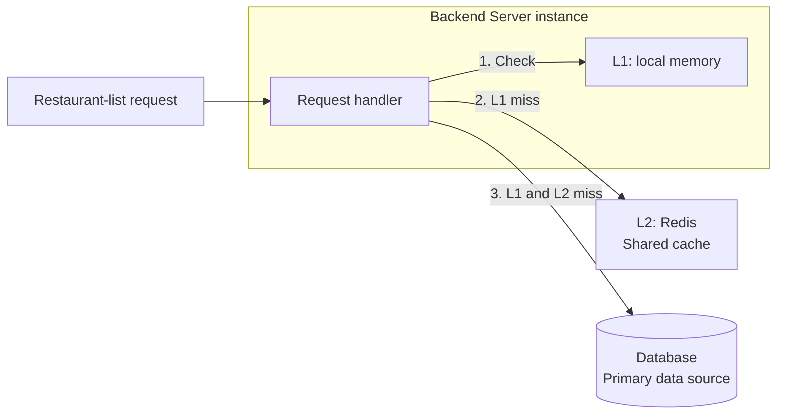

- **L1: local memory.** Each Backend Server instance may keep a short-lived
  Restaurant-list copy in its own process. This avoids a Redis request on a
  local hit. The copy can disappear on restart or eviction at any time.
  Stateless request handling still holds: no confirmed Order or other
  required state depends on this copy.
- **L2: Redis.** All Backend Server instances can use the same cache service.
  On an L1 miss, check Redis. On a Redis miss, read the Database. After a
  successful source read, fill Redis and the requesting instance's L1 cache.
- **Database.** It stores the confirmed records and can rebuild both cache
  layers. If it cannot serve a miss, use the unavailable result from the
  contract above.

Keep `cached_at` with every copy. Apply the same 30-second fresh and
five-minute stale limits to an L1 hit and an L2 hit. A local cache hit must
not extend the age of the data. Bound Database fallback and refresh work
across the Backend Server instances.

**Check:** Instance 1 restarts and loses its L1 copy. Which layer does its
next Restaurant-list request check, and where can it go if that layer is
empty?

## 7. Put the Restaurant-list cache in Redis

### What Redis stores

Redis is a networked, in-memory data store. It holds keys and values in memory
so an application can read them quickly. It supports several value types,
including strings, hashes, lists, sets, and sorted sets. For this example, one
Redis **string** holds the whole Restaurant list as JSON. Redis stores the
bytes; the Backend Server reads the JSON and checks `cached_at`.

```text
key:   restaurant-list:central
value: {"restaurants":[{"id":"r1","name":"Noodle House"}],"cached_at":"2026-10-03T12:00:00Z"}
```

Redis can remove a key when its TTL ends. With a configured
[memory limit and eviction policy](https://redis.io/docs/latest/develop/reference/eviction/),
it can also remove a key earlier to make space. A Redis hit
does not prove that the list is fresh; Section 6's age rule still applies.

### Send commands to Redis

An application connects to Redis over the network and sends commands. The
`redis-cli` tool lets us send the same commands by hand. Here is the
Restaurant-list entry from Section 6:

```sh
redis-cli SET restaurant-list:central '{"restaurants":[{"id":"r1","name":"Noodle House"}],"cached_at":"2026-10-03T12:00:00Z"}' EX 300
redis-cli GET restaurant-list:central
redis-cli TTL restaurant-list:central
```

`SET ... EX 300` writes the JSON string and sets a 300-second expiry. `GET`
returns the string, or no value after expiry. `TTL` shows the remaining
seconds; it returns `-2` if the key does not exist. The timestamp is an
example: when you run this, use the time when the Database result was read.
The TTL starts when `SET` runs. It does not refresh just because `GET` runs.

This is the L2 miss path after the requesting instance's L1 cache misses:

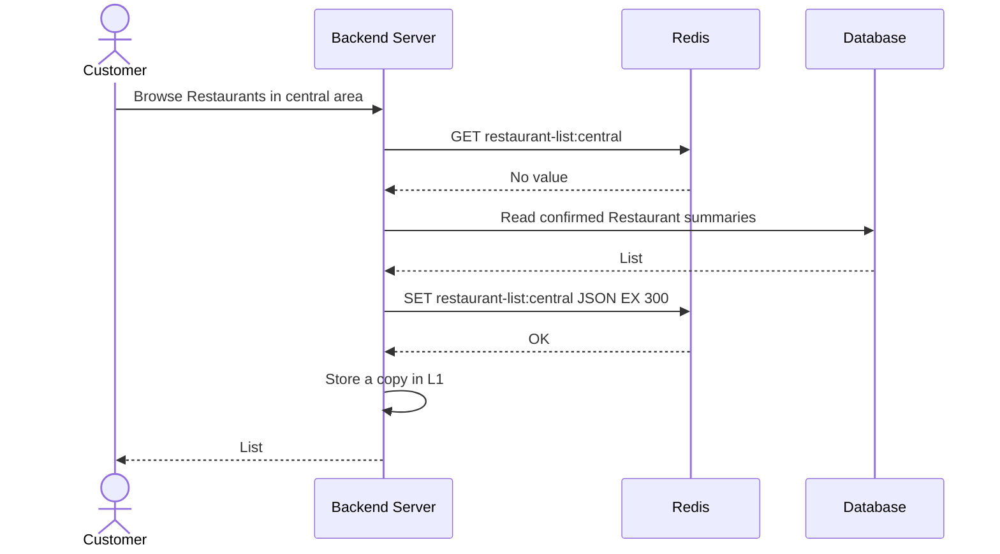

The Backend Server can use the [node-redis client](https://redis.io/docs/latest/develop/clients/nodejs/)
instead of constructing commands itself. This TypeScript code shows the same
read and write operations:

```ts
import { createClient } from "redis";

const redis = createClient({
  url: process.env.REDIS_URL ?? "redis://localhost:6379",
});
redis.on("error", (error) => console.error("Redis error", error));
await redis.connect();

type RestaurantSummary = { id: string; name: string };
type CachedList = {
  restaurants: RestaurantSummary[];
  cached_at: string;
};

function cacheKey(area: string): string {
  return `restaurant-list:${area}`;
}

async function readCachedList(area: string): Promise<CachedList | null> {
  const value = await redis.get(cacheKey(area));
  return value ? (JSON.parse(value) as CachedList) : null;
}

async function storeCachedList(
  area: string,
  restaurants: RestaurantSummary[],
): Promise<void> {
  const entry: CachedList = {
    restaurants,
    cached_at: new Date().toISOString(),
  };
  await redis.set(cacheKey(area), JSON.stringify(entry), { EX: 300 });
}
```

These functions perform the L2 Redis I/O inside Section 6's read path. Check
L1 first. After `readCachedList`, compare
`Date.now() - Date.parse(cached_at)` with 30,000 ms
and 300,000 ms. On a miss, read the Database and call `storeCachedList` only
after a successful source read. For an allowed stale hit, return the list with
`refreshing` and its age, then schedule a bounded refresh. If Redis is
unavailable, use only the Database fallback capacity defined in Section 6.
The Database remains the durable source.

### What survives a restart?

Redis primarily serves from memory. For one Redis instance, disk persistence
is a configuration choice:

| Redis mode | What it writes to disk | What a restart can lose |
| --- | --- | --- |
| No persistence | Nothing | All entries on that instance |
| RDB snapshots | A point-in-time copy | Writes since the last saved snapshot |
| AOF | A log of write commands | Recent writes, depending on when the log is synced to disk |

Redis can also combine RDB and AOF. Replication gives another running copy,
but a replica is not a backup and does not remove every data-loss window. For
this Restaurant-list cache, an empty Redis is acceptable only because the
Database can rebuild entries and fallback traffic is bounded. Enabling Redis
persistence can help restore a warm cache, but it does not change the
Restaurant-list freshness rule.

### Compare a few alternatives

| Store | Data and client model | Disk recovery | Main fit or tradeoff |
| --- | --- | --- | --- |
| [Redis](https://redis.io/docs/latest/develop/data-types/) | Several data types; Redis commands | Optional RDB snapshots and AOF | Flexible cache operations; plan for cache loss and memory limits |
| [Memcached](https://docs.memcached.org/) | Simple in-memory key/value cache; Memcached protocol | [Warm restart](https://docs.memcached.org/features/restart/) can recover a cache after a clean stop; no general-purpose durable store | Good for simple disposable values; fewer data operations |
| [Valkey](https://valkey.io/topics/introduction/) | In-memory data types and Redis-style commands | Optional RDB snapshots and AOF | Similar model to Redis; check command and client compatibility for the chosen versions |
| [Dragonfly](https://www.dragonflydb.io/docs) | Redis- and Memcached-compatible APIs; multithreaded server | Optional disk snapshots | Can serve similar cache workloads; check feature compatibility and operations needs |

The product rule comes first: every option needs a source-read path, a
freshness limit, and a response when the cache is unavailable.

**Try it:** Redis restarts just before dinner traffic and has no persistence.
Which keys are missing? What stops all browse requests from overwhelming the
Database? Would AOF make an old Restaurant list fresh?

## 8. Apply the method to Lab 4

[Lab 4: Scale the Dashboard Read Path](../labs/04-read-heavy-request-path/README.md)
uses the Personal Investment Dashboard. Use its given load and capacity to
size the service and its read replicas. Then decide:

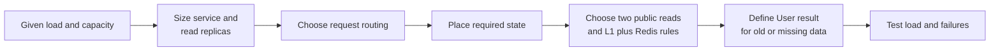

- how the Gateway or request router selects a ready Dashboard instance;
- how accepted market data reaches the write leader and read replicas;
- whether a simple TTL or stale-while-revalidate fits each cache use case;
- how L1 and Redis serve two public reads and how Redis commands fill a key;
- what the User sees for an old provider price, cache failure, or store failure;
- which bounded keys to pre-warm before market open;
- which load and failure tests would support the design.

Do not treat a fast cache response as proof that the Stock price is recent.

## References: read with a question

Use the question to choose where to read first:

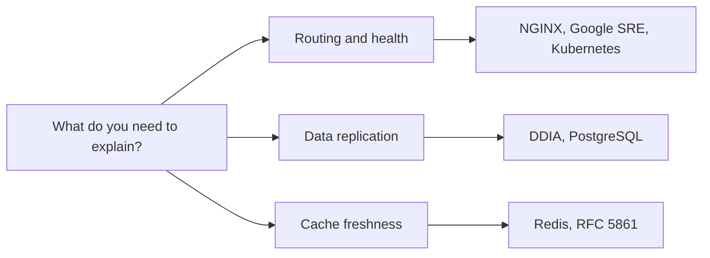

### Core reading

1. [NGINX: HTTP Load Balancing](https://nginx.org/en/docs/http/load_balancing.html).
   Compare the default and least-connected examples. Then check the
   [`ip_hash` directive](https://nginx.org/en/docs/http/ngx_http_upstream_module.html#ip_hash)
   and [TCP `stream` module](https://nginx.org/en/docs/stream/ngx_stream_core_module.html).
   **Question:** Which part of each configuration chooses a backend, and
   which part receives traffic?
2. [Google SRE: Load Balancing in the Datacenter](https://sre.google/sre-book/load-balancing-datacenter/).
   Read "Identifying Bad Tasks" and "Load Balancing Policies." **Question:**
   Why can a healthy-looking instance still be a poor routing choice?
3. [Kubernetes: Liveness, Readiness, and Startup Probes](https://kubernetes.io/docs/concepts/workloads/pods/probes/).
   Read the readiness and liveness definitions and the warning about liveness
   failures. **Question:** Which signal removes an instance from new traffic,
   and which restarts it?
4. [Martin Kleppmann: *Designing Data-Intensive Applications*](https://dataintensive.net/),
   first edition, Chapter 5, "Replication." Read "Setting Up New Followers,"
   "Implementation of Replication Logs," and "Problems with Replication Lag."
   Then compare "Multi-Leader Replication" and "Leaderless Replication."
   **Question:** Why does a new follower need a copy and a log position, and
   when can a read be old?
5. [Redis: Cache-Aside](https://redis.io/docs/latest/develop/use-cases/cache-aside/).
   Follow the miss, source-read, and cache-fill path. **Question:** Why must
   the cache be safe to empty?
6. [Redis: SET command](https://redis.io/docs/latest/commands/set/) and
   [Node.js client](https://redis.io/docs/latest/develop/clients/nodejs/).
   Read the `EX` option and the `set`/`get` examples. **Question:** Which
   command limits how long the Restaurant-list key stays in Redis, and which
   field tells MealDrop its age?

### Explore further

- [Kubernetes: Horizontal Pod Autoscaling](https://kubernetes.io/docs/tasks/run-application/horizontal-pod-autoscale/).
  Read the basic control-loop formula, CPU utilization baseline, and replica
  bounds. **Question:** Why does `500m` CPU request make 300m CPU use equal
  to the 60% target, and why does adding a Pod not add capacity immediately?
- [Kubernetes: Resource Management for Pods and Containers](https://kubernetes.io/docs/concepts/configuration/manage-resources-containers/).
  Read "Requests and limits." **Question:** Which value helps schedule a Pod,
  and which value can throttle its CPU use?
- [Google SRE: Addressing Cascading Failures](https://sre.google/sre-book/addressing-cascading-failures/).
  Read "Handling Overload." **Question:** How can a cache
  failure overload the durable source?
- [PostgreSQL: Log-Shipping Standby Servers](https://www.postgresql.org/docs/current/warm-standby.html).
  Read "Streaming Replication" and "Synchronous Replication." **Question:**
  Which log does a standby replay, and what can a commit wait for?
- [PostgreSQL: Logical Replication](https://www.postgresql.org/docs/current/logical-replication.html).
  Read the overview and [architecture](https://www.postgresql.org/docs/current/logical-replication-architecture.html).
  **Question:** How is a stream of row changes different from physical WAL
  replay?
- [Martin Kleppmann: Please Stop Calling Databases CP or AP](https://martin.kleppmann.com/2015/05/11/please-stop-calling-databases-cp-or-ap.html).
  Read "CAP-Availability" after Section 5. **Question:** Why does one CAP
  label fail to state what an Order-status read returns during a partition?
- [RFC 5861: Stale-While-Revalidate](https://www.rfc-editor.org/rfc/rfc5861.html).
  Read Section 3 for the original HTTP mechanism. **Question:** Which product
  rule must MealDrop define before it serves an old application-cache value?
- [Redis: Persistence](https://redis.io/docs/latest/operate/oss_and_stack/management/persistence/).
  Compare RDB, AOF, and no persistence. **Question:** What can each mode lose
  after a sudden restart?
